# 🔄 POLYMORPHISM REFACTORING - Replace Conditional with Polymorphism

Actúa como **experto en refactoring y patrones de diseño orientado a objetos**.

Tu misión es **eliminar condicionales complejos (if-else, switch) reemplazándolos con polimorfismo** usando Strategy Pattern o Command Pattern según el contexto.

---

## 🎯 CUÁNDO APLICAR ESTA REFACTORIZACIÓN

### ✅ Indicadores de Código que Necesita Refactoring:

1. **If-else anidados con más de 2 niveles**

```java
// ❌ BAD: Deeply nested conditionals
if (type.equals("CREDIT_CARD")) {
    if (amount > 1000) {
        if (customer.isPremium()) {
            // logic
        } else {
            // logic
        }
    }
} else if (type.equals("PAYPAL")) {
    // more logic
}
```

2. **Switch con múltiples cases y lógica compleja**

```java
// ❌ BAD: Complex switch
switch (orderStatus) {
    case PENDING:
        validateInventory();
        checkPayment();
        break;
    case CONFIRMED:
        notifyWarehouse();
        generateInvoice();
        break;
    // 10+ more cases...
}
```

3. **Type checking repetitivo**

```java
// ❌ BAD: Repeated type checking
if (payment instanceof CreditCardPayment) {
    processCreditCard((CreditCardPayment) payment);
} else if (payment instanceof PayPalPayment) {
    processPayPal((PayPalPayment) payment);
} else if (payment instanceof BankTransferPayment) {
    processBankTransfer((BankTransferPayment) payment);
}
```

4. **Condicionales que cambian frecuentemente**

```java
// ❌ BAD: Violation of Open/Closed Principle
if (shippingMethod.equals("STANDARD")) {
    return 5.99;
} else if (shippingMethod.equals("EXPRESS")) {
    return 15.99;
} else if (shippingMethod.equals("OVERNIGHT")) {
    return 29.99;
}
// Every new shipping method requires modifying this code!
```

---

## 🔄 REFACTORING PATTERN 1: STRATEGY PATTERN

**Usar cuando:** Diferentes comportamientos/algoritmos para el mismo propósito

### Antes: Condicionales Anidados

```java
public class PaymentProcessor {

    public PaymentResult processPayment(Payment payment, String method) {
        if (method.equals("CREDIT_CARD")) {
            // Validate credit card
            if (!isValidCardNumber(payment.getCardNumber())) {
                return PaymentResult.failure("Invalid card");
            }

            // Check CVV
            if (!isValidCVV(payment.getCvv())) {
                return PaymentResult.failure("Invalid CVV");
            }

            // Process with payment gateway
            GatewayResponse response = creditCardGateway.charge(payment);

            if (response.isSuccess()) {
                return PaymentResult.success(response.getTransactionId());
            } else {
                return PaymentResult.failure(response.getErrorMessage());
            }

        } else if (method.equals("PAYPAL")) {
            // Validate PayPal account
            if (!isValidPayPalEmail(payment.getEmail())) {
                return PaymentResult.failure("Invalid PayPal email");
            }

            // OAuth flow
            String token = paypalService.authenticate(payment.getEmail());

            if (token == null) {
                return PaymentResult.failure("PayPal authentication failed");
            }

            // Process payment
            PayPalResponse response = paypalService.charge(token, payment.getAmount());

            return response.isSuccess()
                ? PaymentResult.success(response.getTransactionId())
                : PaymentResult.failure(response.getErrorMessage());

        } else if (method.equals("BANK_TRANSFER")) {
            // Validate bank account
            if (!isValidIBAN(payment.getIban())) {
                return PaymentResult.failure("Invalid IBAN");
            }

            // Verify funds
            if (!bankService.hasSufficientFunds(payment.getIban(), payment.getAmount())) {
                return PaymentResult.failure("Insufficient funds");
            }

            // Process transfer
            BankResponse response = bankService.transfer(payment);

            return response.isSuccess()
                ? PaymentResult.success(response.getTransactionId())
                : PaymentResult.failure(response.getErrorMessage());

        } else {
            throw new UnsupportedPaymentMethodException(method);
        }
    }
}
```

### Después: Strategy Pattern

```java
// 1️⃣ Strategy Interface
public interface PaymentStrategy {
    PaymentResult process(Payment payment);
    String getMethodName();
    boolean supports(String method);
}

// 2️⃣ Concrete Strategy: Credit Card
public class CreditCardPaymentStrategy implements PaymentStrategy {

    private final CreditCardGateway gateway;

    public CreditCardPaymentStrategy(CreditCardGateway gateway) {
        this.gateway = gateway;
    }

    @Override
    public PaymentResult process(Payment payment) {
        // Validate
        if (!isValidCardNumber(payment.getCardNumber())) {
            return PaymentResult.failure("Invalid card number");
        }

        if (!isValidCVV(payment.getCvv())) {
            return PaymentResult.failure("Invalid CVV");
        }

        // Process
        GatewayResponse response = gateway.charge(payment);

        return response.isSuccess()
            ? PaymentResult.success(response.getTransactionId())
            : PaymentResult.failure(response.getErrorMessage());
    }

    @Override
    public String getMethodName() {
        return "CREDIT_CARD";
    }

    @Override
    public boolean supports(String method) {
        return "CREDIT_CARD".equalsIgnoreCase(method);
    }
}

// 3️⃣ Concrete Strategy: PayPal
public class PayPalPaymentStrategy implements PaymentStrategy {

    private final PayPalService paypalService;

    public PayPalPaymentStrategy(PayPalService paypalService) {
        this.paypalService = paypalService;
    }

    @Override
    public PaymentResult process(Payment payment) {
        // Validate
        if (!isValidPayPalEmail(payment.getEmail())) {
            return PaymentResult.failure("Invalid PayPal email");
        }

        // Authenticate
        String token = paypalService.authenticate(payment.getEmail());
        if (token == null) {
            return PaymentResult.failure("Authentication failed");
        }

        // Process
        PayPalResponse response = paypalService.charge(token, payment.getAmount());

        return response.isSuccess()
            ? PaymentResult.success(response.getTransactionId())
            : PaymentResult.failure(response.getErrorMessage());
    }

    @Override
    public String getMethodName() {
        return "PAYPAL";
    }

    @Override
    public boolean supports(String method) {
        return "PAYPAL".equalsIgnoreCase(method);
    }
}

// 4️⃣ Concrete Strategy: Bank Transfer
public class BankTransferPaymentStrategy implements PaymentStrategy {

    private final BankService bankService;

    public BankTransferPaymentStrategy(BankService bankService) {
        this.bankService = bankService;
    }

    @Override
    public PaymentResult process(Payment payment) {
        // Validate
        if (!isValidIBAN(payment.getIban())) {
            return PaymentResult.failure("Invalid IBAN");
        }

        // Check funds
        if (!bankService.hasSufficientFunds(payment.getIban(), payment.getAmount())) {
            return PaymentResult.failure("Insufficient funds");
        }

        // Process
        BankResponse response = bankService.transfer(payment);

        return response.isSuccess()
            ? PaymentResult.success(response.getTransactionId())
            : PaymentResult.failure(response.getErrorMessage());
    }

    @Override
    public String getMethodName() {
        return "BANK_TRANSFER";
    }

    @Override
    public boolean supports(String method) {
        return "BANK_TRANSFER".equalsIgnoreCase(method);
    }
}

// 5️⃣ Context with Strategy Registry
public class PaymentProcessor {

    private final Map<String, PaymentStrategy> strategies = new HashMap<>();

    public PaymentProcessor(List<PaymentStrategy> availableStrategies) {
        availableStrategies.forEach(strategy ->
            strategies.put(strategy.getMethodName().toUpperCase(), strategy)
        );
    }

    public PaymentResult processPayment(Payment payment, String method) {
        PaymentStrategy strategy = strategies.get(method.toUpperCase());

        if (strategy == null) {
            throw new UnsupportedPaymentMethodException(
                "Payment method not supported: " + method
            );
        }

        return strategy.process(payment);
    }

    public Set<String> getSupportedMethods() {
        return strategies.keySet();
    }
}

// 6️⃣ Spring Configuration (Optional)
@Configuration
public class PaymentConfig {

    @Bean
    public PaymentProcessor paymentProcessor(List<PaymentStrategy> strategies) {
        return new PaymentProcessor(strategies);
    }

    @Bean
    public PaymentStrategy creditCardStrategy(CreditCardGateway gateway) {
        return new CreditCardPaymentStrategy(gateway);
    }

    @Bean
    public PaymentStrategy paypalStrategy(PayPalService service) {
        return new PayPalPaymentStrategy(service);
    }

    @Bean
    public PaymentStrategy bankTransferStrategy(BankService service) {
        return new BankTransferPaymentStrategy(service);
    }
}
```

**Ventajas:**

- ✅ Cada estrategia en su propia clase (SRP)
- ✅ Agregar nuevo método de pago = nueva clase (OCP)
- ✅ Fácil testing individual
- ✅ No más if-else gigantes
- ✅ Spring auto-detecta strategies

---

## 🔄 REFACTORING PATTERN 2: COMMAND PATTERN

**Usar cuando:** Múltiples acciones/comandos que se ejecutan bajo diferentes condiciones

### Antes: Switch con Acciones

```java
public class OrderProcessor {

    public void executeAction(Order order, String action) {
        switch (action) {
            case "CONFIRM":
                if (order.getStatus() != OrderStatus.PENDING) {
                    throw new IllegalStateException("Order must be pending");
                }
                order.setStatus(OrderStatus.CONFIRMED);
                inventoryService.reserve(order.getItems());
                emailService.sendConfirmation(order);
                break;

            case "CANCEL":
                if (order.getStatus() == OrderStatus.SHIPPED) {
                    throw new IllegalStateException("Cannot cancel shipped order");
                }
                order.setStatus(OrderStatus.CANCELLED);
                inventoryService.release(order.getItems());
                refundService.process(order);
                emailService.sendCancellation(order);
                break;

            case "SHIP":
                if (order.getStatus() != OrderStatus.CONFIRMED) {
                    throw new IllegalStateException("Order must be confirmed");
                }
                order.setStatus(OrderStatus.SHIPPED);
                shippingService.createShipment(order);
                trackingService.generateTrackingNumber(order);
                emailService.sendShippingNotification(order);
                break;

            case "DELIVER":
                if (order.getStatus() != OrderStatus.SHIPPED) {
                    throw new IllegalStateException("Order must be shipped");
                }
                order.setStatus(OrderStatus.DELIVERED);
                order.setDeliveryDate(LocalDateTime.now());
                emailService.sendDeliveryConfirmation(order);
                loyaltyService.awardPoints(order);
                break;

            default:
                throw new IllegalArgumentException("Unknown action: " + action);
        }

        orderRepository.save(order);
    }
}
```

### Después: Command Pattern

```java
// 1️⃣ Command Interface
public interface OrderCommand {
    void execute(Order order);
    String getCommandName();
    boolean canExecute(Order order);
}

// 2️⃣ Abstract Command with Template Method
public abstract class AbstractOrderCommand implements OrderCommand {

    protected final OrderRepository orderRepository;

    protected AbstractOrderCommand(OrderRepository orderRepository) {
        this.orderRepository = orderRepository;
    }

    @Override
    public final void execute(Order order) {
        // Template Method Pattern
        if (!canExecute(order)) {
            throw new IllegalStateException(
                "Cannot execute " + getCommandName() + " on order " + order.getId()
            );
        }

        doExecute(order);
        orderRepository.save(order);
    }

    protected abstract void doExecute(Order order);
}

// 3️⃣ Concrete Command: Confirm Order
public class ConfirmOrderCommand extends AbstractOrderCommand {

    private final InventoryService inventoryService;
    private final EmailService emailService;

    public ConfirmOrderCommand(
        OrderRepository orderRepository,
        InventoryService inventoryService,
        EmailService emailService
    ) {
        super(orderRepository);
        this.inventoryService = inventoryService;
        this.emailService = emailService;
    }

    @Override
    protected void doExecute(Order order) {
        order.setStatus(OrderStatus.CONFIRMED);
        inventoryService.reserve(order.getItems());
        emailService.sendConfirmation(order);
    }

    @Override
    public String getCommandName() {
        return "CONFIRM";
    }

    @Override
    public boolean canExecute(Order order) {
        return order.getStatus() == OrderStatus.PENDING;
    }
}

// 4️⃣ Concrete Command: Cancel Order
public class CancelOrderCommand extends AbstractOrderCommand {

    private final InventoryService inventoryService;
    private final RefundService refundService;
    private final EmailService emailService;

    public CancelOrderCommand(
        OrderRepository orderRepository,
        InventoryService inventoryService,
        RefundService refundService,
        EmailService emailService
    ) {
        super(orderRepository);
        this.inventoryService = inventoryService;
        this.refundService = refundService;
        this.emailService = emailService;
    }

    @Override
    protected void doExecute(Order order) {
        order.setStatus(OrderStatus.CANCELLED);
        inventoryService.release(order.getItems());
        refundService.process(order);
        emailService.sendCancellation(order);
    }

    @Override
    public String getCommandName() {
        return "CANCEL";
    }

    @Override
    public boolean canExecute(Order order) {
        return order.getStatus() != OrderStatus.SHIPPED
            && order.getStatus() != OrderStatus.DELIVERED;
    }
}

// 5️⃣ Concrete Command: Ship Order
public class ShipOrderCommand extends AbstractOrderCommand {

    private final ShippingService shippingService;
    private final TrackingService trackingService;
    private final EmailService emailService;

    public ShipOrderCommand(
        OrderRepository orderRepository,
        ShippingService shippingService,
        TrackingService trackingService,
        EmailService emailService
    ) {
        super(orderRepository);
        this.shippingService = shippingService;
        this.trackingService = trackingService;
        this.emailService = emailService;
    }

    @Override
    protected void doExecute(Order order) {
        order.setStatus(OrderStatus.SHIPPED);
        shippingService.createShipment(order);
        trackingService.generateTrackingNumber(order);
        emailService.sendShippingNotification(order);
    }

    @Override
    public String getCommandName() {
        return "SHIP";
    }

    @Override
    public boolean canExecute(Order order) {
        return order.getStatus() == OrderStatus.CONFIRMED;
    }
}

// 6️⃣ Concrete Command: Deliver Order
public class DeliverOrderCommand extends AbstractOrderCommand {

    private final EmailService emailService;
    private final LoyaltyService loyaltyService;

    public DeliverOrderCommand(
        OrderRepository orderRepository,
        EmailService emailService,
        LoyaltyService loyaltyService
    ) {
        super(orderRepository);
        this.emailService = emailService;
        this.loyaltyService = loyaltyService;
    }

    @Override
    protected void doExecute(Order order) {
        order.setStatus(OrderStatus.DELIVERED);
        order.setDeliveryDate(LocalDateTime.now());
        emailService.sendDeliveryConfirmation(order);
        loyaltyService.awardPoints(order);
    }

    @Override
    public String getCommandName() {
        return "DELIVER";
    }

    @Override
    public boolean canExecute(Order order) {
        return order.getStatus() == OrderStatus.SHIPPED;
    }
}

// 7️⃣ Invoker with Command Registry
public class OrderProcessor {

    private final Map<String, OrderCommand> commands = new HashMap<>();

    public OrderProcessor(List<OrderCommand> availableCommands) {
        availableCommands.forEach(command ->
            commands.put(command.getCommandName(), command)
        );
    }

    public void executeAction(Order order, String action) {
        OrderCommand command = commands.get(action.toUpperCase());

        if (command == null) {
            throw new IllegalArgumentException("Unknown action: " + action);
        }

        command.execute(order);
    }

    public Set<String> getAvailableActions() {
        return commands.keySet();
    }

    public List<String> getAvailableActionsFor(Order order) {
        return commands.values().stream()
            .filter(cmd -> cmd.canExecute(order))
            .map(OrderCommand::getCommandName)
            .toList();
    }
}
```

**Ventajas:**

- ✅ Cada comando encapsula una acción completa
- ✅ Fácil agregar nuevos comandos sin modificar código existente
- ✅ Validación específica por comando
- ✅ Historial/undo posible (si se implementa)
- ✅ Testing aislado por comando

---

## 🔄 REFACTORING PATTERN 3: POLYMORPHISM + INHERITANCE

**Usar cuando:** Type checking con instanceof/getClass()

### Antes: Type Checking

```java
public class NotificationSender {

    public void send(Notification notification) {
        if (notification instanceof EmailNotification) {
            EmailNotification email = (EmailNotification) notification;

            if (!isValidEmail(email.getTo())) {
                throw new IllegalArgumentException("Invalid email");
            }

            emailService.send(
                email.getTo(),
                email.getSubject(),
                email.getBody(),
                email.getAttachments()
            );

        } else if (notification instanceof SmsNotification) {
            SmsNotification sms = (SmsNotification) notification;

            if (!isValidPhoneNumber(sms.getPhoneNumber())) {
                throw new IllegalArgumentException("Invalid phone");
            }

            String message = sms.getMessage();
            if (message.length() > 160) {
                message = message.substring(0, 157) + "...";
            }

            smsService.send(sms.getPhoneNumber(), message);

        } else if (notification instanceof PushNotification) {
            PushNotification push = (PushNotification) notification;

            if (push.getDeviceToken() == null) {
                throw new IllegalArgumentException("Device token required");
            }

            pushService.send(
                push.getDeviceToken(),
                push.getTitle(),
                push.getBody(),
                push.getData()
            );

        } else {
            throw new UnsupportedOperationException(
                "Unknown notification type: " + notification.getClass()
            );
        }

        notification.setStatus(NotificationStatus.SENT);
        notification.setSentAt(LocalDateTime.now());
    }
}
```

### Después: Polymorphism

```java
// 1️⃣ Abstract Base Class
public abstract class Notification {

    protected String id;
    protected NotificationStatus status;
    protected LocalDateTime sentAt;

    // Template Method
    public final void send() {
        validate();
        doSend();
        markAsSent();
    }

    protected abstract void validate();
    protected abstract void doSend();

    private void markAsSent() {
        this.status = NotificationStatus.SENT;
        this.sentAt = LocalDateTime.now();
    }

    // Getters/Setters
}

// 2️⃣ Concrete Class: Email
public class EmailNotification extends Notification {

    private final EmailService emailService;
    private String to;
    private String subject;
    private String body;
    private List<Attachment> attachments;

    public EmailNotification(EmailService emailService) {
        this.emailService = emailService;
    }

    @Override
    protected void validate() {
        if (!isValidEmail(to)) {
            throw new IllegalArgumentException("Invalid email address: " + to);
        }
    }

    @Override
    protected void doSend() {
        emailService.send(to, subject, body, attachments);
    }

    private boolean isValidEmail(String email) {
        return email != null && email.matches("^[A-Za-z0-9+_.-]+@(.+)$");
    }

    // Getters/Setters
}

// 3️⃣ Concrete Class: SMS
public class SmsNotification extends Notification {

    private final SmsService smsService;
    private String phoneNumber;
    private String message;

    private static final int MAX_SMS_LENGTH = 160;

    public SmsNotification(SmsService smsService) {
        this.smsService = smsService;
    }

    @Override
    protected void validate() {
        if (!isValidPhoneNumber(phoneNumber)) {
            throw new IllegalArgumentException("Invalid phone number: " + phoneNumber);
        }
    }

    @Override
    protected void doSend() {
        String truncatedMessage = truncateIfNeeded(message);
        smsService.send(phoneNumber, truncatedMessage);
    }

    private String truncateIfNeeded(String msg) {
        if (msg.length() > MAX_SMS_LENGTH) {
            return msg.substring(0, MAX_SMS_LENGTH - 3) + "...";
        }
        return msg;
    }

    private boolean isValidPhoneNumber(String phone) {
        return phone != null && phone.matches("^\\+?[1-9]\\d{1,14}$");
    }

    // Getters/Setters
}

// 4️⃣ Concrete Class: Push
public class PushNotification extends Notification {

    private final PushService pushService;
    private String deviceToken;
    private String title;
    private String body;
    private Map<String, String> data;

    public PushNotification(PushService pushService) {
        this.pushService = pushService;
    }

    @Override
    protected void validate() {
        if (deviceToken == null || deviceToken.isBlank()) {
            throw new IllegalArgumentException("Device token is required");
        }
    }

    @Override
    protected void doSend() {
        pushService.send(deviceToken, title, body, data);
    }

    // Getters/Setters
}

// 5️⃣ Simplified Sender (no conditionals!)
public class NotificationSender {

    public void send(Notification notification) {
        notification.send(); // Polymorphic call!
    }

    public void sendAll(List<Notification> notifications) {
        notifications.forEach(Notification::send);
    }
}
```

**Ventajas:**

- ✅ Cero if-else o instanceof
- ✅ Cada tipo de notificación maneja su propia lógica
- ✅ Template Method evita duplicación
- ✅ Agregar nuevo tipo = nueva subclase
- ✅ Testing trivial

---

## 📊 GUÍA DE DECISIÓN: ¿QUÉ PATRÓN USAR?

```mermaid
flowchart TD
    Start{¿Tipo de código?}

    Start -->|Algoritmos/comportamientos<br/>intercambiables| Strategy
    Start -->|Acciones/operaciones<br/>discretas| Command
    Start -->|Type checking<br/>con instanceof| Polymorphism

    Strategy[✅ Strategy Pattern]
    Command[✅ Command Pattern]
    Polymorphism[✅ Polymorphism + Inheritance]

    Strategy --> StrategyUse[Ejemplo: Métodos de pago,<br/>cálculo de precios,<br/>validadores]
    Command --> CommandUse[Ejemplo: Acciones sobre<br/>orden, transacciones,<br/>workflow steps]
    Polymorphism --> PolyUse[Ejemplo: Tipos de<br/>notificaciones, exporters,<br/>handlers]
```



| Escenario                                 | Patrón Recomendado       | Razón                            |
| ----------------------------------------- | ------------------------ | -------------------------------- |
| Múltiples algoritmos para misma operación | **Strategy**             | Intercambiable en runtime        |
| Acciones que modifican estado             | **Command**              | Encapsula operación + parámetros |
| Type checking con subtipos                | **Polymorphism**         | Aprovecha jerarquía de clases    |
| Necesita undo/redo                        | **Command**              | Comando puede revertirse         |
| Comportamiento puede combinarse           | **Strategy + Decorator** | Composición flexible             |
| Validación antes de ejecutar              | **Command**              | `canExecute()` method            |

---

## ✅ PASOS DE REFACTORING

### 1️⃣ Identificar el Patrón

```java
// Buscar estos patrones en el código:
if (type.equals(...)) { ... }
else if (type.equals(...)) { ... }

switch (action) { case ...: ... }

if (obj instanceof Type1) { ... }
else if (obj instanceof Type2) { ... }
```

### 2️⃣ Extraer Comportamientos

```java
// Para cada rama del if-else o case:
// 1. Identificar qué hace
// 2. Extraer a método privado
// 3. Identificar dependencias

private void processCreditCard() { ... }
private void processPayPal() { ... }
```

### 3️⃣ Crear Interfaz/Abstract Class

```java
// Definir contrato común
public interface PaymentStrategy {
    PaymentResult process(Payment payment);
}
```

### 4️⃣ Implementar Estrategias/Comandos

```java
// Una clase por cada rama
public class CreditCardStrategy implements PaymentStrategy {
    @Override
    public PaymentResult process(Payment payment) {
        // Lógica del if "CREDIT_CARD"
    }
}
```

### 5️⃣ Crear Registry/Factory

```java
// Mapeo dinámico
Map<String, PaymentStrategy> strategies = ...;
PaymentStrategy strategy = strategies.get(method);
strategy.process(payment);
```

### 6️⃣ Eliminar Condicionales

```java
// ❌ DELETE THIS:
if (method.equals("CREDIT_CARD")) { ... }
else if (method.equals("PAYPAL")) { ... }

// ✅ REPLACE WITH:
strategy.process(payment);
```

---

## 🧪 TESTING

### Testing Strategies/Commands

```java
@DisplayName("Payment Strategies Tests")
class PaymentStrategyTest {

    @Test
    @DisplayName("Credit Card Strategy should process valid payment")
    void testCreditCardStrategy() {
        // Arrange
        CreditCardGateway gateway = mock(CreditCardGateway.class);
        when(gateway.charge(any())).thenReturn(
            GatewayResponse.success("TXN123")
        );

        PaymentStrategy strategy = new CreditCardPaymentStrategy(gateway);
        Payment payment = Payment.builder()
            .amount(new BigDecimal("100.00"))
            .cardNumber("4111111111111111")
            .cvv("123")
            .build();

        // Act
        PaymentResult result = strategy.process(payment);

        // Assert
        assertThat(result.isSuccess()).isTrue();
        assertThat(result.getTransactionId()).isEqualTo("TXN123");
        verify(gateway).charge(payment);
    }

    @Test
    @DisplayName("Should reject invalid CVV")
    void testInvalidCVV() {
        PaymentStrategy strategy = new CreditCardPaymentStrategy(mock(CreditCardGateway.class));
        Payment payment = Payment.builder()
            .cardNumber("4111111111111111")
            .cvv("99") // Invalid
            .build();

        PaymentResult result = strategy.process(payment);

        assertThat(result.isSuccess()).isFalse();
        assertThat(result.getErrorMessage()).contains("Invalid CVV");
    }
}
```

### Testing Polymorphism

```java
@DisplayName("Notification Polymorphism Tests")
class NotificationTest {

    @Test
    @DisplayName("Email notification should send via email service")
    void testEmailNotification() {
        // Arrange
        EmailService emailService = mock(EmailService.class);
        EmailNotification notification = new EmailNotification(emailService);
        notification.setTo("test@example.com");
        notification.setSubject("Test");
        notification.setBody("Body");

        // Act
        notification.send();

        // Assert
        verify(emailService).send("test@example.com", "Test", "Body", emptyList());
        assertThat(notification.getStatus()).isEqualTo(NotificationStatus.SENT);
        assertThat(notification.getSentAt()).isNotNull();
    }

    @ParameterizedTest
    @ValueSource(strings = {"invalid", "test@", "@example.com", ""})
    @DisplayName("Should reject invalid email addresses")
    void testInvalidEmails(String invalidEmail) {
        EmailNotification notification = new EmailNotification(mock(EmailService.class));
        notification.setTo(invalidEmail);

        assertThatThrownBy(() -> notification.send())
            .isInstanceOf(IllegalArgumentException.class)
            .hasMessageContaining("Invalid email");
    }
}
```

---

## 📏 MÉTRICAS DE MEJORA

### Antes del Refactoring:

- ❌ Complejidad ciclomática: 15+
- ❌ Líneas por método: 200+
- ❌ Violación OCP (cada nuevo tipo modifica código existente)
- ❌ Difícil testear (muchos mocks en un test)
- ❌ Duplicación alta

### Después del Refactoring:

- ✅ Complejidad ciclomática: 1-3 por clase
- ✅ Líneas por método: 10-30
- ✅ OCP respetado (nuevas clases, no modificaciones)
- ✅ Tests unitarios simples y aislados
- ✅ Cero duplicación

---

## 💡 TIPS Y BEST PRACTICES

### ✅ DO

1. **Usa Registry Pattern para descubrimiento dinámico**

```java
Map<String, Strategy> registry = strategies.stream()
    .collect(Collectors.toMap(Strategy::getName, Function.identity()));
```

2. **Spring auto-detection**

```java
@Autowired
public StrategyRegistry(List<Strategy> strategies) {
    // Spring inyecta todas las implementaciones
}
```

3. **Validación en cada estrategia**

```java
@Override
public Result execute(Input input) {
    validate(input); // Cada estrategia valida sus propios requisitos
    return doExecute(input);
}
```

4. **Usa nombres descriptivos**

```java
// ❌ Bad
class Strategy1, Strategy2

// ✅ Good
class CreditCardPaymentStrategy, PayPalPaymentStrategy
```

### ❌ DON'T

1. **No uses Strategy para condicionales simples**

```java
// ❌ Overkill para esto:
if (age >= 18) return "adult"; else return "minor";

// ✅ Déjalo como está
```

2. **No mezcles Strategy con Command**

```java
// ❌ Confuso: ¿Es algoritmo o acción?
```

3. **No olvides el principio de sustitución de Liskov**

```java
// ❌ Bad: Estrategia lanza excepción que otras no lanzan
```

---

## 🎯 EJEMPLOS ADICIONALES

### Ejemplo: Discount Calculation

```java
// ❌ BEFORE
public BigDecimal calculateDiscount(Order order) {
    if (order.getCustomer().isVIP()) {
        if (order.getTotal().compareTo(new BigDecimal("1000")) > 0) {
            return order.getTotal().multiply(new BigDecimal("0.20")); // 20%
        } else {
            return order.getTotal().multiply(new BigDecimal("0.10")); // 10%
        }
    } else if (order.getItems().size() > 10) {
        return order.getTotal().multiply(new BigDecimal("0.05")); // 5%
    } else if (order.getTotal().compareTo(new BigDecimal("500")) > 0) {
        return new BigDecimal("50"); // Fixed $50
    } else {
        return BigDecimal.ZERO;
    }
}

// ✅ AFTER: Strategy Pattern
public interface DiscountStrategy {
    BigDecimal calculate(Order order);
    boolean isApplicable(Order order);
}

public class VIPHighValueDiscountStrategy implements DiscountStrategy {
    @Override
    public BigDecimal calculate(Order order) {
        return order.getTotal().multiply(new BigDecimal("0.20"));
    }

    @Override
    public boolean isApplicable(Order order) {
        return order.getCustomer().isVIP()
            && order.getTotal().compareTo(new BigDecimal("1000")) > 0;
    }
}

// More strategies...

public class DiscountCalculator {
    private final List<DiscountStrategy> strategies;

    public BigDecimal calculateDiscount(Order order) {
        return strategies.stream()
            .filter(s -> s.isApplicable(order))
            .map(s -> s.calculate(order))
            .max(BigDecimal::compareTo)
            .orElse(BigDecimal.ZERO);
    }
}
```

---

## 📚 REFERENCIAS

- **Refactoring: Improving the Design of Existing Code** - Martin Fowler
- **Design Patterns: Elements of Reusable OO Software** - Gang of Four
- **Clean Code** - Robert C. Martin

---

**💡 RECUERDA:** Si tienes más de 3 niveles de if-else anidados, es momento de refactorizar. El polimorfismo es tu amigo.
