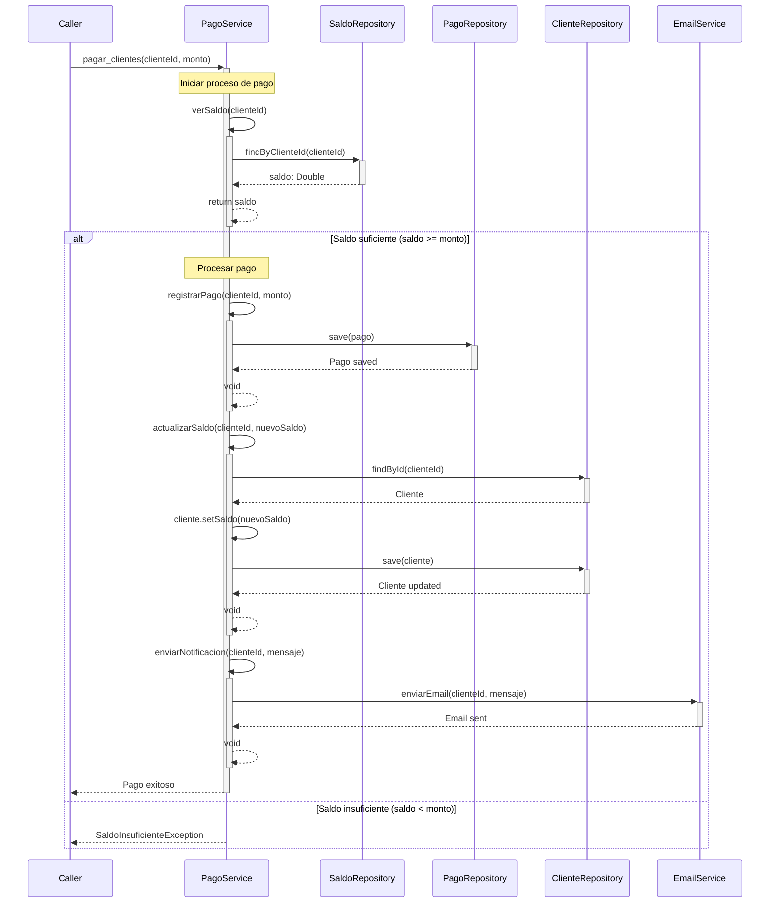
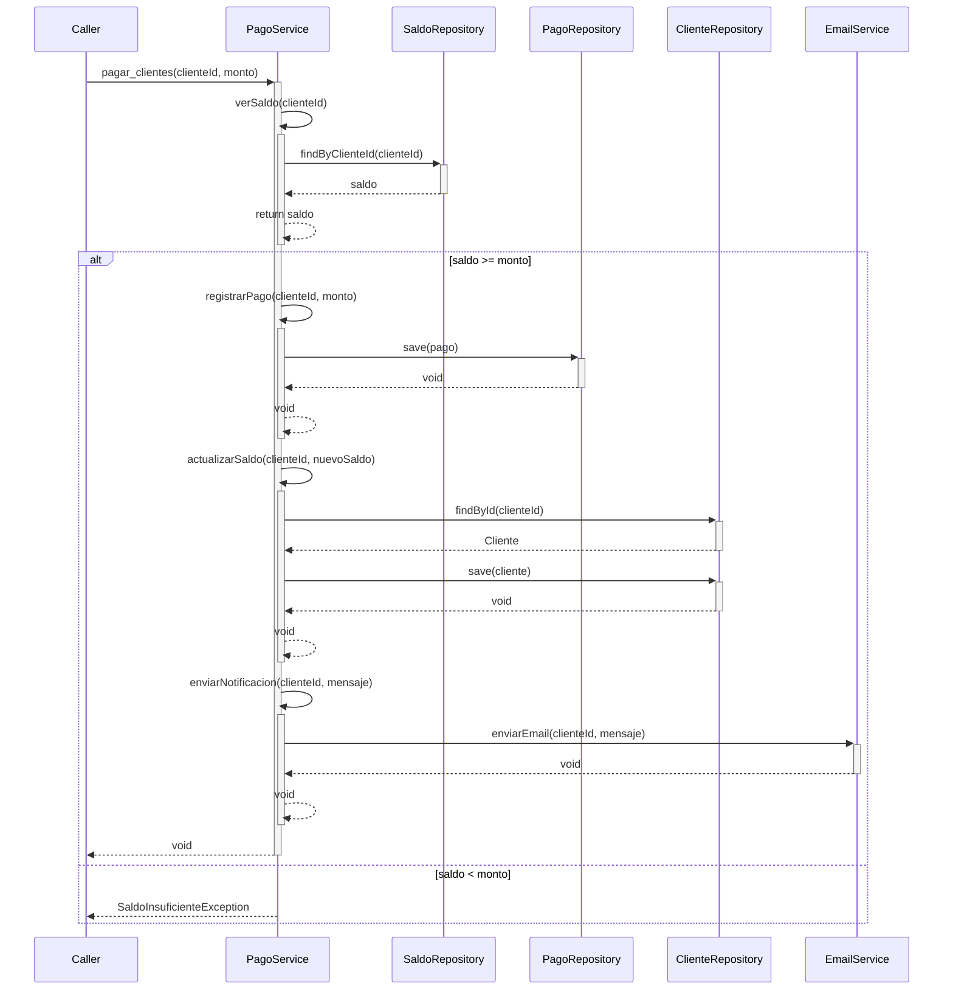

# 🎯 Method Flow Diagram Generator - Skill Interactivo

<div align="center">


</div>

---

## 📖 Descripción

> 🤖 **Skill especializado** en generar diagramas de secuencia Mermaid del flujo interno de métodos.
>
> Analiza cómo un método llama a otros métodos y genera un **diagrama visual** mostrando el flujo completo de ejecución.

---

## 🚀 Cómo Usarlo

**Palabras clave para activar:**

```
"Genera diagrama de flujo del método"
"Analiza el método [nombre]"
"Muestra secuencia del método"
"Diagrama de llamadas del método"
"Traza el flujo de [método]"
```

**Ejemplo de uso:**

```
"Genera diagrama de flujo del método pagar_clientes"
"Analiza el método processPayment"
"Muestra secuencia desde authenticateUser hasta validateToken"
```

**El skill:**

1. 🔍 Identifica el método de inicio
2. 📊 Analiza las llamadas internas
3. 🔗 Mapea la cadena de ejecución
4. 📈 Genera diagrama Mermaid de secuencia
5. 💾 Guarda diagrama en archivo markdown

---

## 🧠 Comportamiento del Skill

### 📏 Reglas Estrictas

<table>
<tr>
<td width="50%" valign="top">

#### ✅ SIEMPRE

- ✅ **Pregunta** método de inicio
- ✅ **Pregunta** si hay método final específico
- ✅ **Analiza** código real del método
- ✅ **Identifica** todas las llamadas internas
- ✅ **Rastrea** profundidad de llamadas
- ✅ **Genera** diagrama Mermaid preciso
- ✅ **Incluye** parámetros y return values

</td>
<td width="50%" valign="top">

#### ❌ NUNCA

- ❌ **Asume** flujo sin analizar código
- ❌ **Omite** llamadas a métodos
- ❌ **Genera** diagramas genéricos
- ❌ **Ignora** condicionales (if/else)
- ❌ **Omite** loops importantes
- ❌ **Deja** información incompleta

</td>
</tr>
</table>

> 💡 **Principio clave:** Precisión basada en el código real.

---

## 📋 Proceso de Generación

### 🔵 Fase 1: Identificar Método de Inicio

**Si el usuario especifica el método:**

```
Usuario: "Genera diagrama del método pagar_clientes"
         → Método inicio: pagar_clientes
```

**Si NO especifica:**

```markdown
## 🎯 Método de Inicio

¿Qué método quieres analizar?

Ejemplos:

- "pagar_clientes"
- "processPayment"
- "UserService.authenticateUser"

Escribe el nombre del método:
```

⏸️ **ESPERAR** respuesta del usuario

---

### 🔶 Fase 2: Configurar Análisis

**Preguntas opcionales:**

```markdown
## ⚙️ Configuración del Análisis

**Método inicial:** `pagar_clientes`

### Opciones:

1️⃣ **¿Hasta qué método quieres rastrear?**

- 📦 "todos" → Analizar todo el flujo
- 🎯 "hasta [método]" → Parar en método específico (ej: "hasta verSaldo")
- 🔢 "nivel 3" → Limitar profundidad de análisis

2️⃣ **¿Incluir llamadas a librerías externas?**

- ✅ "sí" → Incluir (ej: calls to Spring, JPA)
- ❌ "no" → Solo métodos del proyecto (recomendado)

3️⃣ **¿Analizar flujos condicionales?**

- ✅ "sí" → Mostrar if/else, try/catch
- ❌ "no" → Solo flujo principal
```

**Valores por defecto si el usuario no responde:**

- Profundidad: Todos los niveles
- Librerías: No incluir
- Condicionales: Sí incluir

---

### 🔷 Fase 3: Análisis del Código

**Secuencia de análisis:**

1️⃣ **Buscar el método inicial**

```javascript
grep_search("def pagar_clientes|void pagar_clientes|function pagar_clientes", isRegexp: true)
```

2️⃣ **Leer el código completo del método**

```javascript
read_file(filePath, startLine, endLine);
```

3️⃣ **Identificar llamadas a otros métodos**

**Patrones a buscar:**

<table>
<tr>
<th width="30%">Lenguaje</th>
<th width="70%">Patrones de llamada</th>
</tr>
<tr>
<td><b>Java</b></td>
<td>
<code>objeto.metodo()</code><br/>
<code>this.metodo()</code><br/>
<code>Clase.metodoEstatico()</code><br/>
<code>super.metodo()</code>
</td>
</tr>
<tr>
<td><b>Python</b></td>
<td>
<code>self.metodo()</code><br/>
<code>objeto.metodo()</code><br/>
<code>Clase.metodo()</code><br/>
<code>funcion()</code>
</td>
</tr>
<tr>
<td><b>JavaScript</b></td>
<td>
<code>this.metodo()</code><br/>
<code>objeto.metodo()</code><br/>
<code>metodo()</code><br/>
<code>await metodo()</code>
</td>
</tr>
<tr>
<td><b>C#</b></td>
<td>
<code>objeto.Metodo()</code><br/>
<code>this.Metodo()</code><br/>
<code>Clase.Metodo()</code><br/>
<code>await MetodoAsync()</code>
</td>
</tr>
</table>

4️⃣ **Para cada método encontrado, repetir el proceso**

```python
def analizar_metodo(nombre_metodo, nivel=0, max_nivel=5):
    if nivel > max_nivel:
        return

    # Buscar método
    codigo = buscar_y_leer_metodo(nombre_metodo)

    # Identificar llamadas
    llamadas = extraer_llamadas(codigo)

    # Recursivamente analizar cada llamada
    for llamada in llamadas:
        if not es_libreria_externa(llamada):
            analizar_metodo(llamada, nivel + 1, max_nivel)
```

5️⃣ **Identificar estructuras de control**

```python
# Detectar condicionales
if "if (" in codigo or "if(" in codigo:
    analizar_ramas_condicionales()

# Detectar loops
if "for (" in codigo or "while (" in codigo:
    analizar_loops()

# Detectar try-catch
if "try {" in codigo:
    analizar_excepciones()
```

---

### 🔹 Fase 4: Generar Diagrama Mermaid

**Ejemplo de flujo simple:**

**Código de entrada:**

```java
public void pagar_clientes(Long clienteId, Double monto) {
    // 1. Verificar saldo
    Double saldo = verSaldo(clienteId);

    // 2. Validar si hay saldo suficiente
    if (saldo >= monto) {
        // 3. Registrar pago
        registrarPago(clienteId, monto);

        // 4. Actualizar saldo
        actualizarSaldo(clienteId, saldo - monto);

        // 5. Enviar notificación
        enviarNotificacion(clienteId, "Pago exitoso");
    } else {
        throw new SaldoInsuficienteException();
    }
}

private Double verSaldo(Long clienteId) {
    return saldoRepository.findByClienteId(clienteId);
}

private void registrarPago(Long clienteId, Double monto) {
    Pago pago = new Pago(clienteId, monto);
    pagoRepository.save(pago);
}

private void actualizarSaldo(Long clienteId, Double nuevoSaldo) {
    Cliente cliente = clienteRepository.findById(clienteId);
    cliente.setSaldo(nuevoSaldo);
    clienteRepository.save(cliente);
}

private void enviarNotificacion(Long clienteId, String mensaje) {
    emailService.enviarEmail(clienteId, mensaje);
}
```

**Diagrama Mermaid generado:**



---

### 🔸 Fase 5: Crear Archivo de Documentación

**Estructura del archivo:**

````markdown
# 📊 Diagrama de Flujo: [NombreMetodo]

---

## 📍 Información General

**Método:** `pagar_clientes`  
**Clase:** `PagoService`  
**Archivo:** `PagoService.java`  
**Líneas:** 45-78

---

## 🎯 Propósito

[Descripción del propósito del método]

---

## 📥 Parámetros

| Parámetro   | Tipo   | Descripción    |
| ----------- | ------ | -------------- |
| `clienteId` | Long   | ID del cliente |
| `monto`     | Double | Monto a pagar  |

---

## 📤 Return

**Tipo:** `void`  
**Descripción:** No retorna valor, modifica estado

---

## 🔄 Flujo de Ejecución

### Métodos Llamados (en orden):

1. **verSaldo(clienteId)** → `Double`
   - Obtiene el saldo actual del cliente
   - Llama a: `SaldoRepository.findByClienteId()`

2. **registrarPago(clienteId, monto)** → `void`
   - Registra el pago en la base de datos
   - Llama a: `PagoRepository.save()`

3. **actualizarSaldo(clienteId, nuevoSaldo)** → `void`
   - Actualiza el saldo del cliente
   - Llama a: `ClienteRepository.findById()`, `ClienteRepository.save()`

4. **enviarNotificacion(clienteId, mensaje)** → `void`
   - Envía email de confirmación
   - Llama a: `EmailService.enviarEmail()`

---

## 📊 Diagrama de Secuencia

```mermaid
[diagrama generado aquí]
```
````

---

## 🔀 Flujos Condicionales

### ✅ Flujo Exitoso (Saldo >= Monto)

1. Verificar saldo
2. Registrar pago
3. Actualizar saldo
4. Enviar notificación
5. Retornar éxito

### ❌ Flujo de Error (Saldo < Monto)

1. Verificar saldo
2. Lanzar `SaldoInsuficienteException`

---

## ⚠️ Excepciones

| Excepción                    | Condición         | Manejo                     |
| ---------------------------- | ----------------- | -------------------------- |
| `SaldoInsuficienteException` | saldo < monto     | Propagada al caller        |
| `EntityNotFoundException`    | Cliente no existe | Propagada desde repository |

---

## 📝 Código del Método

```java
[código completo del método]
```

---

## 🔗 Dependencias

**Interno:**

- `verSaldo()`
- `registrarPago()`
- `actualizarSaldo()`
- `enviarNotificacion()`

**Externo:**

- `SaldoRepository.findByClienteId()`
- `PagoRepository.save()`
- `ClienteRepository.findById()`
- `ClienteRepository.save()`
- `EmailService.enviarEmail()`

---

## 📈 Métricas

**Profundidad de llamadas:** 3 niveles  
**Total de métodos involucrados:** 9  
**Complejidad ciclomática:** 3  
**Número de llamadas a DB:** 4

---

**Generado el:** 2026-02-07  
**Método analizado:** `pagar_clientes`  
**Versión:** 1.0

```

**Nombre del archivo:**
```

FLOW-[NombreClase]-[NombreMetodo].md

```

**Ubicación:**
```

docs/flows/[NombreClase]/

```

**Ejemplo:**
```

docs/flows/PagoService/FLOW-PagoService-pagar_clientes.md

```

---

## 🎨 Formato de Conversación

### Ejemplo de Sesión Completa

```

Usuario:
"Genera diagrama de flujo del método pagar_clientes"

Skill:

## 🎯 Method Flow Diagram Generator

Voy a analizar el flujo del método: **pagar_clientes**

---

### 🔍 Buscando método...

✅ Método encontrado en: `PagoService.java` (líneas 45-78)

---

## ⚙️ Configuración del Análisis

### Opciones de análisis:

1️⃣ **¿Hasta dónde quieres rastrear el flujo?**

- 📦 "todos" → Analizar todo el flujo completo
- 🎯 "hasta verSaldo" → Parar en un método específico
- 🔢 "nivel 3" → Limitar a 3 niveles de profundidad

2️⃣ **¿Incluir llamadas a librerías/frameworks?**

- ❌ "no" → Solo métodos de tu código (recomendado)
- ✅ "sí" → Incluir Spring, JPA, etc.

Por defecto: todos los niveles, sin librerías externas

---

Usuario:
"todos, sin librerías"

Skill:
✅ **Configuración:**

- Profundidad: Ilimitada
- Librerías externas: No incluidas
- Flujos condicionales: Incluidos

---

### 📊 Analizando flujo...

🔍 Leyendo método principal...
✅ `pagar_clientes` (método principal)

🔍 Identificando llamadas...
✅ Encontradas 4 llamadas directas:

1.  verSaldo(clienteId)
2.  registrarPago(clienteId, monto)
3.  actualizarSaldo(clienteId, nuevoSaldo)
4.  enviarNotificacion(clienteId, mensaje)

🔍 Analizando nivel 2...
✅ `verSaldo` → llama a: SaldoRepository.findByClienteId()
✅ `registrarPago` → llama a: PagoRepository.save()
✅ `actualizarSaldo` → llama a: ClienteRepository.findById(), ClienteRepository.save()
✅ `enviarNotificacion` → llama a: EmailService.enviarEmail()

🔍 Detectando estructuras de control...
✅ Condicional: if (saldo >= monto)
✅ Rama alternativa: throw SaldoInsuficienteException

---

### 📊 Resumen del Análisis

**Métodos analizados:** 5  
**Profundidad máxima:** 2 niveles  
**Llamadas totales:** 9  
**Flujos condicionales:** 1 (if/else)  
**Excepciones:** 1 (SaldoInsuficienteException)

---

### 🎨 Generando diagrama Mermaid...

✅ Diagrama generado (34 líneas)

---

## 🎉 ¡Diagrama Completado!

### 📄 Archivo creado:

📁 `docs/flows/PagoService/FLOW-PagoService-pagar_clientes.md`

### 📊 Vista previa del diagrama:



---

¿Analizar otro método? 🚀

````

---

## 🛠️ Tools a Usar

<table>
<tr>
<th width="30%">Tool</th>
<th width="70%">Uso</th>
</tr>
<tr>
<td><b>🔍 grep_search</b></td>
<td>
Buscar método inicial por nombre<br/>
Encontrar definiciones de métodos<br/>
Identificar llamadas a métodos<br/>
Buscar patrones de código
</td>
</tr>
<tr>
<td><b>📖 read_file</b></td>
<td>
Leer código completo del método<br/>
Leer métodos llamados<br/>
Analizar estructuras de control<br/>
Extraer parámetros y return types
</td>
</tr>
<tr>
<td><b>🔗 list_code_usages</b></td>
<td>
Ver dónde se usa un método<br/>
Identificar dependencias<br/>
Mapear flujo completo
</td>
</tr>
<tr>
<td><b>🔎 semantic_search</b></td>
<td>
Buscar métodos sin nombre exacto<br/>
Encontrar métodos relacionados<br/>
Contextualizar flujo
</td>
</tr>
<tr>
<td><b>📁 create_file</b></td>
<td>
Crear archivo de documentación<br/>
Guardar diagrama Mermaid<br/>
En ubicación correcta
</td>
</tr>
<tr>
<td><b>📋 manage_todo_list</b></td>
<td>
Trackear análisis<br/>
• Método encontrado<br/>
• Llamadas identificadas<br/>
• Profundidad analizada<br/>
• Diagrama generado
</td>
</tr>
</table>

---

## 🔍 Patrones de Detección

### Identificar Llamadas a Métodos

<details>
<summary><b>🔍 Click para ver regex patterns por lenguaje</b></summary>

**Java:**
```regex
# Llamada a método de instancia
(\w+)\.(\w+)\s*\(

# Llamada a método propio
this\.(\w+)\s*\(

# Llamada a método estático
[A-Z]\w+\.(\w+)\s*\(

# Llamada a método de superclase
super\.(\w+)\s*\(
````

**Python:**

```regex
# Llamada a método de instancia
self\.(\w+)\s*\(

# Llamada a método de objeto
(\w+)\.(\w+)\s*\(

# Llamada a función
^(\w+)\s*\(
```

**JavaScript/TypeScript:**

```regex
# Llamada a método
(\w+)\.(\w+)\s*\(

# Llamada con this
this\.(\w+)\s*\(

# Llamada async/await
await\s+(\w+)\.(\w+)\s*\(
```

**C#:**

```regex
# Llamada a método
(\w+)\.(\w+)\s*\(

# Llamada async
await\s+(\w+)\s*\(

# Llamada a método estático
[A-Z]\w+\.(\w+)\s*\(
```

</details>

---

## 🔒 Constraints Finales

<table>
<tr>
<td width="50%" bgcolor="#ffebee">

### ❌ NUNCA

- ❌ Generar sin analizar código
- ❌ Asumir llamadas sin verificar
- ❌ Omitir flujos condicionales
- ❌ Ignorar recursividad
- ❌ Diagrama genérico sin datos reales
- ❌ Perder track de la profundidad

</td>
<td width="50%" bgcolor="#e8f5e9">

### ✅ SIEMPRE

- ✅ Analizar código real
- ✅ Verificar cada llamada
- ✅ Incluir condicionales
- ✅ Detectar loops infinitos
- ✅ Diagrama basado en código
- ✅ Limitar profundidad razonable

</td>
</tr>
</table>

### 🛡️ Principios de Operación

```diff
+ CÓDIGO REAL sobre SUPOSICIONES
+ PRECISIÓN sobre COMPLETITUD
+ DIAGRAMAS VISUALES sobre TEXTO
+ ANÁLISIS PROFUNDO sobre ANÁLISIS SUPERFICIAL
+ FLUJOS CONDICIONALES sobre SOLO FLUJO FELIZ
```

---

## 💡 Casos de Uso

<details>
<summary><b>📚 Ejemplos de cuándo usar este skill</b></summary>

### ✅ Casos ideales:

1. **Debugging complejo**
   - "¿Cómo llega mi código a este método?"
   - "¿Qué métodos se ejecutan antes de X?"

2. **Code review**
   - "Necesito entender el flujo de pago"
   - "¿Qué pasa cuando llamo a authenticate?"

3. **Documentación**
   - "Documentar flujo de nuevo feature"
   - "Explicar proceso de negocio"

4. **Onboarding**
   - "Mostrar a nuevo dev cómo funciona X"
   - "Entender código legacy"

5. **Refactoring**
   - "Identificar dependencias antes de refactor"
   - "Ver impacto de cambios"

### ❌ No usar para:

- Arquitectura de alto nivel (usar otros diagramas)
- Flujos HTTP completos (usar documentation-api skill)
- Diagramas de clases (usar herramientas UML)

</details>

---

<div align="center">

### 💚 Listo para Usar

**Palabras clave de activación:**

_"Genera diagrama de flujo del método [nombre]"_

---


</div>
