# Spring Boot to Quarkus Migration Guide 🚀

**Guía Completa para Migración Reactiva de Spring Boot a Quarkus**

_Versión: 1.0 | Estado: Production Ready | Última actualización: 30 de enero de 2026_

---

## 📋 Tabla de Contenidos

1. [Visión General](#visión-general)
2. [Estructura del Proyecto](#estructura-del-proyecto)
3. [Requisitos Previos](#requisitos-previos)
4. [Inicio Rápido](#inicio-rápido)
5. [Fases de Migración](#fases-de-migración)
6. [Ejemplos Detallados](#ejemplos-detallados)
7. [Configuración Completa](#configuración-completa)
8. [Testing](#testing)
9. [Troubleshooting](#troubleshooting)
10. [FAQ](#faq)

---

## 🎯 Visión General

### Propósito

Este agente de migración proporciona un proceso completo, estructurado y documentado para transformar proyectos **Spring Boot con arquitectura reactiva** (Retrofit + OpenAPI + RxJava) a **Quarkus con Mutiny**.

### ¿Por qué Quarkus?

| Aspecto                   | Spring Boot        | Quarkus     |
| ------------------------- | ------------------ | ----------- |
| **Startup**               | 5-15 segundos      | < 1 segundo |
| **Memory (RSS)**          | 300-500 MB         | 50-80 MB    |
| **Time to First Request** | 5-15s              | < 100ms     |
| **Cloud Native**          | Bueno              | Excelente   |
| **Reactivo**              | Webflux (opcional) | Nativo      |
| **Tamaño JAR**            | 50-100 MB          | 10-20 MB    |

### Tecnologías Mapeadas

| Spring Boot                | Quarkus                      | Tipo              |
| -------------------------- | ---------------------------- | ----------------- |
| **Spring Boot Framework**  | Quarkus Core                 | Runtime           |
| **Retrofit 2**             | Quarkus REST Client Reactive | Cliente HTTP      |
| **RxJava2/RxJava3**        | Mutiny                       | Stack Reactivo    |
| **RestTemplate**           | Quarkus REST Client          | Cliente HTTP Sync |
| **Spring WebFlux**         | Quarkus Reactive             | Web Reactivo      |
| **@Configuration**         | @ApplicationScoped           | Beans CDI         |
| **@Service**               | @ApplicationScoped           | Servicios         |
| **@Autowired**             | @Inject                      | Inyección         |
| **@RestController**        | @Path                        | Endpoints         |
| **application.properties** | application.properties       | Config            |
| **Spring Data JPA**        | Hibernate Panache ORM        | ORM               |
| **OpenAPI 3.0**            | SmallRye OpenAPI             | Documentación     |

---

## 📁 Estructura del Proyecto

```
Migrator-Spring-to-Quarkus/
│
├── 📖 README.md (TÚ ESTÁS AQUÍ)
│
├── 🤖 .github/
│   ├── agents/
│   │   └── spring-to-quarkus-migrator.md
│   │       └── Definición, responsabilidades y flujo del agente
│   │
│   ├── 📋 instructions/ (LEE ESTAS GUÍAS EN ORDEN)
│   │   ├── 01-MIGRATION-OVERVIEW.md      ← Comienza aquí
│   │   ├── 02-RETROFIT-MIGRATION.md      ← Retrofit → REST Client
│   │   ├── 03-OPENAPI-MIGRATION.md       ← OpenAPI + Generación
│   │   ├── 04-REACTIVE-STACK.md          ← RxJava → Mutiny
│   │   ├── 05-CONFIGURATION.md           ← Properties y Beans
│   │   └── 06-TESTING.md                 ← Tests Quarkus
│   │
│   ├── 💭 prompts/ (USA CUANDO NECESITES AYUDA)
│   │   ├── system-prompt.md              ← Contexto general
│   │   ├── retrofit-migration-prompt.md  ← Asistencia Retrofit
│   │   └── reactive-stack-prompt.md      ← Asistencia Mutiny
│   │
│   └── 🛠️ skills/ (PROCEDIMIENTOS DETALLADOS)
│       ├── 01-quarkus-setup-skill.md           ← Crear base Quarkus
│       ├── 02-retrofit-migration-skill.md      ← Migrar Retrofit
│       └── 03-openapi-generation-skill.md      ← Generar DTOs
│
├── 📦 spring-quarkus-migration/
│   ├── original-spring/         ⚠️ TU PROYECTO (NO MODIFICAR)
│   │   └── src/main/java/...
│   │
│   └── quarkus-project/         ✨ LA MIGRACIÓN (TRABAJA AQUÍ)
│       ├── src/main/java/
│       ├── src/test/java/
│       ├── pom.xml
│       └── application.properties
│
├── MIGRATION_CHECKLIST.md        ✅ Checklist de 10 fases
├── INDEX.md                      🔍 Índice y referencias
└── RESUMEN_CREACION.md          📊 Resumen de creación

```

---

## ✅ Requisitos Previos

### Software Requerido

```bash
# Verificar instalaciones
java -version           # Java 17+ (recomendado 21)
mvn -version           # Maven 3.8.1+
docker --version       # Docker (opcional, para testing)
```

### Dependencias Base

- **Java 17 o superior** (recomendado Java 21 LTS)
- **Maven 3.8.1+**
- **Quarkus 2.16+ LTS**
- Tu proyecto **Spring Boot 2.x+ con:**
  - Retrofit 2
  - OpenAPI 3.0 contract
  - RxJava2/RxJava3 o Project Reactor

### IDE Recomendado

- **IntelliJ IDEA 2022.3+** (o Community)
- **VS Code** con Java Extension Pack
- **Eclipse** 2022-06+

---

## 🚀 Inicio Rápido

### Paso 1: Copiar Proyecto Original

```bash
# Navega al directorio
cd /Users/yegecali/Projects/poc-function-java/Migrator-Spring-to-Quarkus

# Copia tu proyecto Spring
cp -r /ruta/a/tu/proyecto-spring spring-quarkus-migration/original-spring/

# Verifica estructura
ls -la spring-quarkus-migration/original-spring/src/
```

### Paso 2: Entender la Arquitectura

1. **Lee la definición del agente** (5 min)

   ```bash
   cat .github/agents/spring-to-quarkus-migrator.md
   ```

2. **Entiende el flujo general** (10 min)
   ```bash
   cat .github/instructions/01-MIGRATION-OVERVIEW.md
   ```

### Paso 3: Comenzar Migración

Sigue las **10 fases** en orden:

```
Fase 1:  Preparación y Análisis
   ↓
Fase 2:  Setup Base Quarkus
   ↓
Fase 3:  Configurar Dependencias
   ↓
Fase 4:  Migrar OpenAPI
   ↓
Fase 5:  Migrar Retrofit → REST Client
   ↓
Fase 6:  Stack Reactivo (RxJava → Mutiny)
   ↓
Fase 7:  Servicios y Lógica
   ↓
Fase 8:  Endpoints REST
   ↓
Fase 9:  Testing Completo
   ↓
Fase 10: Validación Final
```

---

## 📊 Fases de Migración

### Fase 1: Preparación (30 min)

**Objetivo:** Analizar el proyecto original y crear estructura base.

```bash
# 1.1 Copiar proyecto original
cp -r /tu/proyecto-spring spring-quarkus-migration/original-spring/

# 1.2 Analizar estructura
ls -R spring-quarkus-migration/original-spring/src/main/java/

# 1.3 Documentar:
# - Interfaz Retrofit principales
# - Versión de RxJava
# - Dependencias Spring
# - Versión OpenAPI
```

**Checklist:**

- [ ] Proyecto copiado correctamente
- [ ] Retrofit interfaces identificadas
- [ ] OpenAPI contract localizado
- [ ] Documentación de dependencias completa

---

### Fase 2: Setup Quarkus Base (15 min)

**Objetivo:** Crear estructura Quarkus base.

**Seguir:** `.github/skills/01-quarkus-setup-skill.md`

```bash
# 2.1 Crear pom.xml base
cd spring-quarkus-migration/quarkus-project/

# 2.2 Estructura de directorios
mkdir -p src/main/java/com/example/{client,service,resource,config}
mkdir -p src/test/java/com/example/{resource,service}
mkdir -p src/main/resources

# 2.3 Crear archivo pom.xml (ver archivo skill para template)

# 2.4 Validar compilación
mvn clean compile
```

**pom.xml esencial:**

```xml
<?xml version="1.0"?>
<project xsi:schemaLocation="http://maven.apache.org/POM/4.0.0
http://maven.apache.org/xsd/maven-4.0.0.xsd">
    <modelVersion>4.0.0</modelVersion>
    <groupId>com.example</groupId>
    <artifactId>my-quarkus-app</artifactId>
    <version>1.0.0</version>

    <properties>
        <quarkus.platform.group-id>io.quarkus.platform</quarkus.platform.group-id>
        <quarkus.platform.artifact-id>quarkus-bom</quarkus.platform.artifact-id>
        <quarkus.platform.version>2.16.0.Final</quarkus.platform.version>
        <project.build.sourceEncoding>UTF-8</project.build.sourceEncoding>
        <maven.compiler.target>17</maven.compiler.target>
        <maven.compiler.source>17</maven.compiler.source>
    </properties>

    <dependencyManagement>
        <dependencies>
            <dependency>
                <groupId>${quarkus.platform.group-id}</groupId>
                <artifactId>${quarkus.platform.artifact-id}</artifactId>
                <version>${quarkus.platform.version}</version>
                <type>pom</type>
                <scope>import</scope>
            </dependency>
        </dependencies>
    </dependencyManagement>

    <dependencies>
        <!-- REST Reactive -->
        <dependency>
            <groupId>io.quarkus</groupId>
            <artifactId>quarkus-resteasy-reactive</artifactId>
        </dependency>

        <!-- REST Client Reactive (para Retrofit) -->
        <dependency>
            <groupId>io.quarkus</groupId>
            <artifactId>quarkus-rest-client-reactive</artifactId>
        </dependency>

        <!-- JSON Support -->
        <dependency>
            <groupId>io.quarkus</groupId>
            <artifactId>quarkus-resteasy-reactive-jackson</artifactId>
        </dependency>

        <!-- Mutiny (Reactive) -->
        <dependency>
            <groupId>io.quarkus</groupId>
            <artifactId>quarkus-mutiny</artifactId>
        </dependency>

        <!-- OpenAPI/Swagger -->
        <dependency>
            <groupId>io.quarkus</groupId>
            <artifactId>quarkus-smallrye-openapi</artifactId>
        </dependency>

        <!-- Testing -->
        <dependency>
            <groupId>io.quarkus</groupId>
            <artifactId>quarkus-junit5</artifactId>
            <scope>test</scope>
        </dependency>

        <dependency>
            <groupId>io.rest-assured</groupId>
            <artifactId>rest-assured</artifactId>
            <scope>test</scope>
        </dependency>
    </dependencies>

    <build>
        <plugins>
            <plugin>
                <groupId>io.quarkus.platform</groupId>
                <artifactId>quarkus-maven-plugin</artifactId>
                <version>${quarkus.platform.version}</version>
                <executions>
                    <execution>
                        <goals>
                            <goal>build</goal>
                        </goals>
                    </execution>
                </executions>
            </plugin>
            <plugin>
                <artifactId>maven-surefire-plugin</artifactId>
                <version>2.22.1</version>
                <configuration>
                    <systemPropertyVariables>
                        <java.util.logging.manager>org.jboss.logmanager.LogManager</java.util.logging.manager>
                    </systemPropertyVariables>
                </configuration>
            </plugin>
        </plugins>
    </build>
</project>
```

**Checklist:**

- [ ] Directorio `quarkus-project/` creado
- [ ] `pom.xml` con todas las dependencias
- [ ] `mvn clean compile` exitoso
- [ ] Estructura de directorios correcta

---

### Fase 3: Migrar Dependencias (30 min)

**Objetivo:** Reemplazar todas las dependencias Spring por Quarkus.

**Mapeo de Dependencias:**

```xml
<!-- REMOVER (Spring) -->
<!--
<dependency>
    <groupId>org.springframework.boot</groupId>
    <artifactId>spring-boot-starter-web</artifactId>
</dependency>
<dependency>
    <groupId>com.squareup.retrofit2</groupId>
    <artifactId>retrofit</artifactId>
</dependency>
<dependency>
    <groupId>com.squareup.retrofit2</groupId>
    <artifactId>adapter-rxjava2</artifactId>
</dependency>
<dependency>
    <groupId>io.reactivex.rxjava2</groupId>
    <artifactId>rxjava</artifactId>
</dependency>
-->

<!-- AGREGAR (Quarkus) -->
<dependency>
    <groupId>io.quarkus</groupId>
    <artifactId>quarkus-resteasy-reactive</artifactId>
</dependency>
<dependency>
    <groupId>io.quarkus</groupId>
    <artifactId>quarkus-rest-client-reactive</artifactId>
</dependency>
<dependency>
    <groupId>io.quarkus</groupId>
    <artifactId>quarkus-mutiny</artifactId>
</dependency>
```

**Validar:**

```bash
mvn dependency:tree
mvn clean compile
```

**Checklist:**

- [ ] Todas las dependencias Spring eliminadas
- [ ] Todas las dependencias Quarkus agregadas
- [ ] Sin conflictos de versión
- [ ] Compilación exitosa

---

### Fase 4: OpenAPI Integration (30-60 min)

**Objetivo:** Mantener contrato OpenAPI y generar DTOs.

**Seguir:** `.github/instructions/03-OPENAPI-MIGRATION.md` y `.github/skills/03-openapi-generation-skill.md`

#### 4.1 Agregar Plugin OpenAPI Generator

```xml
<plugin>
    <groupId>org.openapitools</groupId>
    <artifactId>openapi-generator-maven-plugin</artifactId>
    <version>6.2.1</version>
    <executions>
        <execution>
            <goals>
                <goal>generate</goal>
            </goals>
            <configuration>
                <inputSpec>${project.basedir}/src/main/resources/openapi.yaml</inputSpec>
                <generatorName>java</generatorName>
                <apiPackage>com.example.api.generated</apiPackage>
                <modelPackage>com.example.api.generated.model</modelPackage>
                <configOptions>
                    <sourceFolder>src/main/java</sourceFolder>
                    <dateLibrary>java8</dateLibrary>
                    <library>resttemplate</library>
                </configOptions>
            </configuration>
        </execution>
    </executions>
</plugin>
```

#### 4.2 Copiar OpenAPI Contract

```bash
# Copiar archivo openapi.yaml/json
cp /tu/proyecto-spring/openapi.yaml \
   spring-quarkus-migration/quarkus-project/src/main/resources/

# Validar
ls -la src/main/resources/openapi.*
```

#### 4.3 Generar DTOs

```bash
mvn clean generate-sources

# Verificar
ls -la target/generated-sources/openapi/java/com/example/api/generated/model/
```

**Checklist:**

- [ ] OpenAPI contract copiado
- [ ] Plugin configurado
- [ ] DTOs generados exitosamente
- [ ] Clases accesibles en el IDE

---

### Fase 5: Migrar Retrofit → REST Client Reactive (1-2h)

**Objetivo:** Convertir Retrofit interfaces a Quarkus REST Client.

**Seguir:** `.github/instructions/02-RETROFIT-MIGRATION.md` y `.github/skills/02-retrofit-migration-skill.md`

#### Ejemplo: Migración Completa

**ANTES (Spring + Retrofit + RxJava):**

```java
// original-spring/src/main/java/com/example/client/ApiClient.java
import retrofit2.http.*;
import io.reactivex.Observable;
import java.util.List;

public interface ApiClient {
    @GET("pets")
    Observable<List<Pet>> listPets(@Query("limit") int limit);

    @GET("pets/{id}")
    Observable<Pet> getPetById(@Path("id") String id);

    @POST("pets")
    Observable<Pet> createPet(@Body Pet pet);

    @PUT("pets/{id}")
    Observable<Pet> updatePet(@Path("id") String id, @Body Pet pet);

    @DELETE("pets/{id}")
    Observable<Void> deletePet(@Path("id") String id);
}
```

```java
// original-spring/src/main/java/com/example/service/PetService.java
import org.springframework.stereotype.Service;
import retrofit2.Retrofit;
import io.reactivex.Schedulers;

@Service
public class PetService {
    private ApiClient client;

    public PetService(Retrofit retrofit) {
        this.client = retrofit.create(ApiClient.class);
    }

    public Observable<List<Pet>> getAllPets(int limit) {
        return client.listPets(limit)
            .subscribeOn(Schedulers.io());
    }

    public Observable<Pet> getPet(String id) {
        return client.getPetById(id)
            .subscribeOn(Schedulers.io());
    }
}
```

```java
// original-spring/src/main/java/com/example/controller/PetController.java
import org.springframework.web.bind.annotation.*;
import io.reactivex.Observable;

@RestController
@RequestMapping("/api/pets")
public class PetController {
    @Autowired
    private PetService petService;

    @GetMapping
    public Observable<List<Pet>> listPets(
        @RequestParam(defaultValue = "10") int limit
    ) {
        return petService.getAllPets(limit);
    }

    @GetMapping("/{id}")
    public Observable<Pet> getPet(@PathVariable String id) {
        return petService.getPet(id);
    }
}
```

**DESPUÉS (Quarkus + REST Client Reactive + Mutiny):**

```java
// quarkus-project/src/main/java/com/example/client/ApiClient.java
import org.eclipse.microprofile.rest.client.inject.RegisterRestClient;
import jakarta.ws.rs.*;
import jakarta.ws.rs.core.MediaType;
import io.smallrye.mutiny.Uni;
import java.util.List;

@RegisterRestClient(configKey = "pet-api")
@Path("/api")
@Produces(MediaType.APPLICATION_JSON)
@Consumes(MediaType.APPLICATION_JSON)
public interface ApiClient {

    @GET
    @Path("/pets")
    Uni<List<Pet>> listPets(@QueryParam("limit") @DefaultValue("10") int limit);

    @GET
    @Path("/pets/{id}")
    Uni<Pet> getPetById(@PathParam("id") String id);

    @POST
    @Path("/pets")
    Uni<Pet> createPet(Pet pet);

    @PUT
    @Path("/pets/{id}")
    Uni<Pet> updatePet(@PathParam("id") String id, Pet pet);

    @DELETE
    @Path("/pets/{id}")
    Uni<Void> deletePet(@PathParam("id") String id);
}
```

```java
// quarkus-project/src/main/java/com/example/service/PetService.java
import org.eclipse.microprofile.rest.client.inject.RestClient;
import jakarta.enterprise.context.ApplicationScoped;
import jakarta.inject.Inject;
import io.smallrye.mutiny.Uni;
import java.util.List;

@ApplicationScoped
public class PetService {

    @Inject
    @RestClient
    ApiClient client;

    public Uni<List<Pet>> getAllPets(int limit) {
        return client.listPets(limit);
    }

    public Uni<Pet> getPet(String id) {
        return client.getPetById(id);
    }

    public Uni<Pet> createPet(Pet pet) {
        return client.createPet(pet);
    }

    public Uni<Pet> updatePet(String id, Pet pet) {
        return client.updatePet(id, pet);
    }

    public Uni<Void> deletePet(String id) {
        return client.deletePet(id);
    }
}
```

```java
// quarkus-project/src/main/java/com/example/resource/PetResource.java
import jakarta.ws.rs.*;
import jakarta.ws.rs.core.MediaType;
import jakarta.inject.Inject;
import io.smallrye.mutiny.Uni;
import java.util.List;

@Path("/api/pets")
@Produces(MediaType.APPLICATION_JSON)
@Consumes(MediaType.APPLICATION_JSON)
public class PetResource {

    @Inject
    PetService petService;

    @GET
    public Uni<List<Pet>> listPets(@QueryParam("limit") @DefaultValue("10") int limit) {
        return petService.getAllPets(limit);
    }

    @GET
    @Path("/{id}")
    public Uni<Pet> getPet(@PathParam("id") String id) {
        return petService.getPet(id);
    }

    @POST
    public Uni<Pet> createPet(Pet pet) {
        return petService.createPet(pet);
    }

    @PUT
    @Path("/{id}")
    public Uni<Pet> updatePet(@PathParam("id") String id, Pet pet) {
        return petService.updatePet(id, pet);
    }

    @DELETE
    @Path("/{id}")
    public Uni<Void> deletePet(@PathParam("id") String id) {
        return petService.deletePet(id);
    }
}
```

#### 5.1 Configurar REST Client

**application.properties:**

```properties
# REST Client Configuration
quarkus.rest-client.pet-api.url=http://localhost:8080
quarkus.rest-client.pet-api.connect-timeout=5000
quarkus.rest-client.pet-api.read-timeout=10000
quarkus.rest-client.pet-api.scope=jakarta.inject.Singleton

# Logging
quarkus.log.category."org.eclipse.microprofile.rest.client".level=DEBUG
```

**Checklist:**

- [ ] Interfaz REST Client creada
- [ ] @RegisterRestClient anotado
- [ ] Métodos retornan Uni<T>
- [ ] Configuración en application.properties
- [ ] Service inyecta @RestClient
- [ ] Resource usa service

---

### Fase 6: Stack Reactivo (RxJava → Mutiny) (2-4h)

**Objetivo:** Convertir todas las operaciones reactivas a Mutiny.

**Seguir:** `.github/instructions/04-REACTIVE-STACK.md` y `.github/prompts/reactive-stack-prompt.md`

#### Mapeo de Operadores

| RxJava 2        | Mutiny                | Descripción       |
| --------------- | --------------------- | ----------------- |
| `Observable<T>` | `Uni<T>`              | 0 o 1 item        |
| `Flowable<T>`   | `Multi<T>`            | Múltiples items   |
| `Single<T>`     | `Uni<T>`              | Exactamente 1     |
| `Completable`   | `Uni<Void>`           | Sin retorno       |
| `.map(f)`       | `.map(f)`             | Transformar       |
| `.flatMap(f)`   | `.flatMap(f)`         | Transformar a Uni |
| `.filter(p)`    | `.filter(p)`          | Filtrar           |
| `.onError(...)` | `.onFailure()...`     | Manejo errores    |
| `.retry()`      | `.retry()...`         | Reintentos        |
| `.timeout()`    | `.ifNoItem().after()` | Timeout           |

#### Ejemplo: Conversión

**ANTES (RxJava):**

```java
public Observable<Pet> getPetWithDetails(String id) {
    return client.getPetById(id)
        .subscribeOn(Schedulers.io())
        .flatMap(pet ->
            client.getOwner(pet.getOwnerId())
                .map(owner -> {
                    pet.setOwner(owner);
                    return pet;
                })
        )
        .timeout(10, TimeUnit.SECONDS)
        .retry(3)
        .onErrorResumeNext(error ->
            Observable.just(new Pet())
        );
}
```

**DESPUÉS (Mutiny):**

```java
public Uni<Pet> getPetWithDetails(String id) {
    return client.getPetById(id)
        .flatMap(pet ->
            client.getOwner(pet.getOwnerId())
                .map(owner -> {
                    pet.setOwner(owner);
                    return pet;
                })
        )
        .ifNoItem()
        .after(Duration.ofSeconds(10))
        .fail()
        .retry()
        .withBackOff(Duration.ofMillis(100))
        .atMost(3)
        .onFailure()
        .recoverWithItem(() -> new Pet());
}
```

**Checklist:**

- [ ] Observable → Uni migrado
- [ ] flatMap/map convertido
- [ ] Error handling implementado
- [ ] Timeout configurado
- [ ] Reintentos implementados
- [ ] Compilación exitosa

---

### Fase 7: Configuración (30-60 min)

**Objetivo:** Migrar propiedades, beans y perfiles.

**Seguir:** `.github/instructions/05-CONFIGURATION.md`

#### 7.1 application.properties

**Mapeo Spring → Quarkus:**

```properties
# SPRING (original)
spring.application.name=pet-api
spring.datasource.url=jdbc:mysql://localhost:3306/petdb
spring.datasource.username=root
spring.datasource.password=secret
spring.jpa.hibernate.ddl-auto=update
spring.profiles.active=dev
server.port=8080

# QUARKUS (nuevo)
quarkus.application.name=pet-api
quarkus.datasource.jdbc.url=jdbc:mysql://localhost:3306/petdb
quarkus.datasource.username=root
quarkus.datasource.password=secret
quarkus.hibernate-orm.database.generation=update
quarkus.profile=dev
quarkus.http.port=8080
```

#### 7.2 Perfiles

**application-dev.properties:**

```properties
quarkus.profile=dev
quarkus.http.port=8080
quarkus.log.level=DEBUG
quarkus.datasource.jdbc.url=jdbc:mysql://localhost:3306/petdb
```

**application-prod.properties:**

```properties
quarkus.profile=prod
quarkus.http.port=8080
quarkus.log.level=INFO
quarkus.datasource.jdbc.url=jdbc:mysql://prod-db-host:3306/petdb
```

**Usar:**

```bash
java -jar target/quarkus-app/quarkus-run.jar -Dquarkus.profile=prod
```

#### 7.3 Beans CDI

**ANTES (Spring):**

```java
@Configuration
public class AppConfig {
    @Bean
    public RestTemplate restTemplate() {
        return new RestTemplate();
    }

    @Bean
    public ObjectMapper objectMapper() {
        return new ObjectMapper();
    }
}
```

**DESPUÉS (Quarkus CDI):**

```java
@ApplicationScoped
public class AppConfig {
    @Singleton
    public ObjectMapper objectMapper() {
        return new ObjectMapper();
    }
}
```

**Checklist:**

- [ ] Properties migradas
- [ ] Perfiles configurados
- [ ] Beans convertidos a CDI
- [ ] Compilación exitosa

---

### Fase 8: REST Endpoints (1-2h)

**Objetivo:** Crear endpoints REST funcionales.

Ya migrados en la Fase 5, pero validar:

**Checklist:**

- [ ] @Path anotaciones correctas
- [ ] @Produces/@Consumes presentes
- [ ] Métodos retornan Uni<T>
- [ ] @DefaultValue para parámetros
- [ ] Error handling implementado

---

### Fase 9: Testing (1-2h)

**Objetivo:** Crear suite de tests completa.

**Seguir:** `.github/instructions/06-TESTING.md`

#### 9.1 Test de Endpoint

```java
// quarkus-project/src/test/java/com/example/resource/PetResourceTest.java
package com.example.resource;

import io.quarkus.test.junit.QuarkusTest;
import io.restassured.RestAssured;
import org.junit.jupiter.api.Test;

import static io.restassured.RestAssured.*;
import static org.hamcrest.Matchers.*;

@QuarkusTest
public class PetResourceTest {

    @Test
    void testListPets() {
        given()
            .queryParam("limit", 10)
        .when()
            .get("/api/pets")
        .then()
            .statusCode(200)
            .body("$", hasSize(greaterThanOrEqualTo(0)));
    }

    @Test
    void testGetPetById() {
        given()
        .when()
            .get("/api/pets/1")
        .then()
            .statusCode(200)
            .body("id", equalTo(1));
    }

    @Test
    void testCreatePet() {
        String pet = "{ \"name\": \"Fluffy\", \"type\": \"cat\" }";

        given()
            .contentType("application/json")
            .body(pet)
        .when()
            .post("/api/pets")
        .then()
            .statusCode(201)
            .body("name", equalTo("Fluffy"));
    }
}
```

#### 9.2 Test de Service

```java
// quarkus-project/src/test/java/com/example/service/PetServiceTest.java
package com.example.service;

import io.quarkus.test.junit.QuarkusTest;
import io.quarkus.test.InjectMock;
import io.smallrye.mutiny.Uni;
import org.eclipse.microprofile.rest.client.inject.RestClient;
import org.junit.jupiter.api.Test;
import com.example.client.ApiClient;
import com.example.model.Pet;

import static org.junit.jupiter.api.Assertions.*;
import static org.mockito.Mockito.*;

@QuarkusTest
public class PetServiceTest {

    @InjectMock
    @RestClient
    ApiClient api;

    @Test
    void testGetPet() {
        // Arrange
        Pet expectedPet = new Pet();
        expectedPet.setId("123");
        expectedPet.setName("Fluffy");

        when(api.getPetById("123"))
            .thenReturn(Uni.createFrom().item(expectedPet));

        // Injetar service con mock
        PetService service = new PetService() {
            { this.client = api; }
        };

        // Act & Assert
        Pet pet = service.getPet("123")
            .subscribeAsCompletionStage()
            .toCompletableFuture()
            .join();

        assertNotNull(pet);
        assertEquals("Fluffy", pet.getName());
        verify(api).getPetById("123");
    }
}
```

**Ejecutar:**

```bash
# Tests
mvn clean test

# Con cobertura
mvn clean test jacoco:report

# Ver reporte
open target/site/jacoco/index.html
```

**Checklist:**

- [ ] Tests de endpoints creados
- [ ] Tests de servicios creados
- [ ] Mock de REST Client implementado
- [ ] Cobertura > 80%
- [ ] Todos los tests pasan

---

### Fase 10: Validación Final (1h)

**Objetivo:** Validar funcionalidad, performance y documentación.

#### 10.1 Build y Run

```bash
# Build
mvn clean package

# Ejecutar en dev mode
mvn quarkus:dev

# Debería logar algo como:
# __ ____ __ _____
# __ / / ___ / /_
# / / / / __ `/ / / __ \/ / / __ `/ __/
# / /_/ / /_/ / / / / / / /__/ /_/ / /
# \____/\__,_/_/_/_/ /_/\__/\__,_/_/
# Listening on: http://localhost:8080
```

#### 10.2 Validar Endpoints

```bash
# Lista de pets
curl http://localhost:8080/api/pets

# Pet específica
curl http://localhost:8080/api/pets/1

# Swagger/OpenAPI
curl http://localhost:8080/q/openapi

# Swagger UI
open http://localhost:8080/q/swagger-ui
```

#### 10.3 Performance

```bash
# Build nativo (si quieres GraalVM)
mvn clean package -Pnative

# Tamaño JAR
ls -lh target/quarkus-app/

# Memory en runtime
# Debería ser: 50-120MB (vs 300-400MB Spring Boot)

# Startup time
# Debería ser: < 1 segundo (vs 2-3 segundos Spring Boot)
```

#### 10.4 Coverage de Tests

```bash
mvn clean test
# Resultado: > 80% coverage
```

**Checklist:**

- [ ] `mvn clean package` exitoso
- [ ] JAR < 100MB
- [ ] Startup < 2 segundos
- [ ] Memory < 200MB
- [ ] Todos los tests pasan
- [ ] Swagger UI funcionando
- [ ] Endpoints responden correctamente
- [ ] MIGRATION_CHECKLIST.md actualizado

---

## 🔧 Configuración Completa Referencia

### pom.xml Completo

Ver `.github/skills/01-quarkus-setup-skill.md` para template completo.

### application.properties Completa

```properties
# === APLICACIÓN ===
quarkus.application.name=pet-api
quarkus.application.version=1.0.0

# === HTTP ===
quarkus.http.port=8080
quarkus.http.host=0.0.0.0

# === DATABASE ===
quarkus.datasource.jdbc.url=jdbc:mysql://localhost:3306/petdb
quarkus.datasource.username=root
quarkus.datasource.password=secret
quarkus.datasource.jdbc.connection-validation-query=SELECT 1
quarkus.hibernate-orm.database.generation=update
quarkus.hibernate-orm.log.sql=false

# === REST CLIENT ===
quarkus.rest-client.pet-api.url=http://localhost:8080
quarkus.rest-client.pet-api.connect-timeout=5000
quarkus.rest-client.pet-api.read-timeout=10000
quarkus.rest-client.pet-api.scope=jakarta.inject.Singleton

# === LOGGING ===
quarkus.log.level=INFO
quarkus.log.category."com.example".level=DEBUG
quarkus.log.category."org.eclipse.microprofile.rest.client".level=DEBUG

# === OPENAPI ===
quarkus.smallrye-openapi.info-title=Pet API
quarkus.smallrye-openapi.info-version=1.0.0
quarkus.smallrye-openapi.info-description=Pet Management API
quarkus.smallrye-openapi.operation-id-strategy=method

# === PERFILE ===
%dev.quarkus.log.level=DEBUG
%dev.quarkus.http.cors=true

%prod.quarkus.log.level=INFO
%prod.quarkus.datasource.jdbc.url=jdbc:mysql://prod-host:3306/petdb
```

---

## 📚 Ejemplos Prácticos Completos

### Ejemplo 1: Servicio Simple con REST Client

**ANTES (Spring + Retrofit):**

```java
// UserApi.java (Retrofit)
public interface UserApi {
    @GET("users")
    Observable<List<User>> getUsers();
}

// UserService.java (Spring)
@Service
public class UserService {
    @Autowired
    private UserApi api;

    public Observable<List<User>> getAllUsers() {
        return api.getUsers()
            .subscribeOn(Schedulers.io());
    }
}

// UserController.java (Spring)
@RestController
@RequestMapping("/users")
public class UserController {
    @Autowired
    private UserService service;

    @GetMapping
    public Observable<List<User>> getUsers() {
        return service.getAllUsers();
    }
}
```

**DESPUÉS (Quarkus + REST Client + Mutiny):**

```java
// UserApi.java (Quarkus REST Client)
@RegisterRestClient(configKey = "user-api")
@Path("/users")
@Produces(MediaType.APPLICATION_JSON)
public interface UserApi {
    @GET
    Uni<List<User>> getUsers();
}

// UserService.java (Quarkus)
@ApplicationScoped
public class UserService {
    @Inject
    @RestClient
    private UserApi api;

    public Uni<List<User>> getAllUsers() {
        return api.getUsers();
    }
}

// UserResource.java (Quarkus)
@Path("/users")
@Produces(MediaType.APPLICATION_JSON)
public class UserResource {
    @Inject
    private UserService service;

    @GET
    public Uni<List<User>> getUsers() {
        return service.getAllUsers();
    }
}
```

**application.properties:**

```properties
quarkus.rest-client.user-api.url=http://jsonplaceholder.typicode.com
```

---

### Ejemplo 2: Error Handling Reactivo

**ANTES (RxJava):**

```java
public Observable<User> getUser(String id) {
    return api.getUser(id)
        .subscribeOn(Schedulers.io())
        .onErrorResumeNext(throwable -> {
            if (throwable instanceof NotFoundException) {
                return Observable.just(new User());
            }
            return Observable.error(throwable);
        })
        .timeout(10, TimeUnit.SECONDS)
        .retry(3);
}
```

**DESPUÉS (Mutiny):**

```java
public Uni<User> getUser(String id) {
    return api.getUser(id)
        .onFailure(NotFoundException.class)
        .recoverWithItem(() -> new User())
        .ifNoItem()
        .after(Duration.ofSeconds(10))
        .fail()
        .retry()
        .withBackOff(Duration.ofMillis(100))
        .atMost(3);
}
```

---

### Ejemplo 3: Múltiples Llamadas Encadenadas

**ANTES (RxJava):**

```java
public Observable<UserWithPosts> getUserWithPosts(String userId) {
    return api.getUser(userId)
        .subscribeOn(Schedulers.io())
        .flatMap(user ->
            api.getUserPosts(userId)
                .map(posts -> {
                    user.setPosts(posts);
                    return user;
                })
        )
        .observeOn(Schedulers.mainThread());
}
```

**DESPUÉS (Mutiny):**

```java
public Uni<UserWithPosts> getUserWithPosts(String userId) {
    return api.getUser(userId)
        .flatMap(user ->
            api.getUserPosts(userId)
                .map(posts -> {
                    user.setPosts(posts);
                    return user;
                })
        );
    // Threading es automático en Quarkus
}
```

---

## 🔴 Troubleshooting

### Problema: `ClassNotFoundException` en Runtime

**Síntoma:**

```
ClassNotFoundException: com.squareup.retrofit2.Retrofit
```

**Solución:**

```bash
# Verificar pom.xml no tiene dependencias Retrofit
grep -i "retrofit" pom.xml

# Limpiar y reconstruir
mvn clean install
```

---

### Problema: REST Client no se inyecta

**Síntoma:**

```
InjectionException: Unsatisfied dependency for type ApiClient
```

**Solución:**

```java
// Verificar:
// 1. Interfaz tiene @RegisterRestClient
@RegisterRestClient(configKey = "api")
public interface ApiClient { }

// 2. Inyección tiene @RestClient
@Inject
@RestClient
ApiClient api;

// 3. application.properties tiene URL
quarkus.rest-client.api.url=http://...
```

---

### Problema: `Uni<T>` no es reconocido

**Síntoma:**

```
Cannot resolve symbol 'Uni'
```

**Solución:**

```xml
<!-- Agregar dependencia en pom.xml -->
<dependency>
    <groupId>io.quarkus</groupId>
    <artifactId>quarkus-mutiny</artifactId>
</dependency>
```

---

### Problema: Tests no funcionan

**Síntoma:**

```
No active test containers
```

**Solución:**

```java
// Usar @QuarkusTest
@QuarkusTest
public class MyTest {
    // Tests aquí
}
```

---

### Problema: Dev mode no inicia

**Síntoma:**

```
Failed to start application
```

**Solución:**

```bash
# 1. Verificar Java 17+
java -version

# 2. Compilar antes
mvn clean compile

# 3. Ver logs
mvn quarkus:dev -DdebugOutput=true

# 4. Si falla, probar build primero
mvn clean package
```

---

### Problema: Timeout en REST Client

**Síntoma:**

```
IOOB: ReadTimeoutException
```

**Solución:**

```properties
# Aumentar timeouts en application.properties
quarkus.rest-client.api.connect-timeout=15000
quarkus.rest-client.api.read-timeout=30000
```

---

## ❓ FAQ

### P: ¿Puedo mantener Spring Boot?

**R:** No. La migración es a Quarkus completo. Pero el proyecto original está en `original-spring/` como referencia.

---

### P: ¿Cuánto tiempo lleva la migración?

**R:** Depende del proyecto:

- **Pequeño (1-3 services):** 4-8 horas
- **Mediano (3-10 services):** 1-2 días
- **Grande (10+ services):** 2-5 días

---

### P: ¿Mi código RxJava seguirá funcionando?

**R:** No. Debes convertir a Mutiny. Pero es sencillo:

```java
Observable<T> → Uni<T>
Flowable<T> → Multi<T>
.subscribeOn() → Automático
```

---

### P: ¿Necesito GraalVM?

**R:** Opcional. Quarkus funciona con JVM normal:

```bash
# JVM Mode (recomendado para comenzar)
mvn clean package
java -jar target/quarkus-app/quarkus-run.jar

# Native Mode (con GraalVM)
mvn clean package -Pnative
```

---

### P: ¿Qué pasa con la base de datos?

**R:** Quarkus soporta todas las bases:

- MySQL
- PostgreSQL
- MongoDB
- SQLite
- Etc.

Simplemente cambia la propiedad `quarkus.datasource.jdbc.url`.

---

### P: ¿Es compatible con Spring Security?

**R:** No. Usa Quarkus Security:

```xml
<dependency>
    <groupId>io.quarkus</groupId>
    <artifactId>quarkus-security</artifactId>
</dependency>
```

---

### P: ¿Dónde está la documentación Quarkus?

**R:** https://quarkus.io/guides/

---

### P: ¿Puedo usar Spring Data JPA?

**R:** No. Usa Quarkus Panache ORM:

```xml
<dependency>
    <groupId>io.quarkus</groupId>
    <artifactId>quarkus-hibernate-orm-panache</artifactId>
</dependency>
```

---

### P: ¿Cómo pruebo localmente?

**R:** Usa dev mode:

```bash
mvn quarkus:dev

# Aplicación en: http://localhost:8080
# Swagger UI en: http://localhost:8080/q/swagger-ui
# Dev UI en: http://localhost:8080/q/dev
```

---

### P: ¿Puedo tener múltiples perfiles?

**R:** Sí:

```properties
# application-dev.properties
# application-prod.properties
# application-test.properties

# Usar:
mvn quarkus:dev -Dquarkus.profile=dev
java -jar target/quarkus-app/quarkus-run.jar -Dquarkus.profile=prod
```

---

### P: ¿Se pierde funcionalidad?

**R:** No. Quarkus es más potente:

- Más rápido
- Menos memoria
- Mejor soporte reactivo
- Cloud-native ready

---

## 📊 Checklist Final de Migración

### Pre-Migración

- [ ] Proyecto original analizado
- [ ] Todas las dependencias documentadas
- [ ] Interfaz Retrofit identificadas
- [ ] OpenAPI contract accesible
- [ ] Permisos de escritura en directorios

### Durante Migración

- [ ] Fase 1: Preparación ✅
- [ ] Fase 2: Setup Quarkus ✅
- [ ] Fase 3: Dependencias ✅
- [ ] Fase 4: OpenAPI ✅
- [ ] Fase 5: Retrofit Migration ✅
- [ ] Fase 6: Stack Reactivo ✅
- [ ] Fase 7: Configuración ✅
- [ ] Fase 8: Endpoints ✅
- [ ] Fase 9: Testing ✅
- [ ] Fase 10: Validación ✅

### Post-Migración

- [ ] Compilación sin errores
- [ ] Tests > 80% cobertura y todos pasan
- [ ] Startup < 2 segundos
- [ ] Memory < 200MB
- [ ] Endpoints responden correctamente
- [ ] OpenAPI/Swagger funcional
- [ ] Documentación actualizada
- [ ] Proyecto original en `original-spring/` intacto

---

## 🎓 Recursos Adicionales

### Documentación Oficial

- [Quarkus Guide](https://quarkus.io/guides/)
- [Quarkus REST Client](https://quarkus.io/guides/rest-client-reactive)
- [Mutiny Documentation](https://smallrye.io/smallrye-mutiny/)
- [Jakarta EE](https://jakarta.ee/)

### Comunidad

- [Quarkus Community](https://quarkus.io/community/)
- [Stack Overflow - quarkus](https://stackoverflow.com/questions/tagged/quarkus)

### Herramientas

- [Quarkus CLI](https://quarkus.io/guides/cli-tooling)
- [OpenAPI Generator](https://openapi-generator.tech/)

---

## 📞 Soporte

Si encuentras problemas:

1. **Consulta el archivo de instrucciones relevante**
   - `.github/instructions/01-06.md`

2. **Usa los prompts especializados**
   - `.github/prompts/system-prompt.md`
   - `.github/prompts/retrofit-migration-prompt.md`
   - `.github/prompts/reactive-stack-prompt.md`

3. **Sigue los skills paso a paso**
   - `.github/skills/01-03.md`

4. **Revisa la sección Troubleshooting arriba**

---

## 📝 Notas de Versión

### Versión 1.0 (30 de enero de 2026)

- ✅ Agente completo
- ✅ 6 guías de instrucciones
- ✅ 3 prompts especializados
- ✅ 3 skills procedimentales
- ✅ 10 fases de migración
- ✅ Ejemplos completos
- ✅ Testing integral
- ✅ Troubleshooting incluido

---

## 📄 Licencia

Este agente de migración es de dominio público y puede ser usado libremente.

---

**¡Listo para comenzar tu migración! 🚀**

Próximo paso: Lee `.github/agents/spring-to-quarkus-migrator.md`

# Resultado: DTOs generados, documentación automática

````

#### Fase 4: Stack Reactivo

```bash
# Seguir: .github/instructions/04-REACTIVE-STACK.md
# Usar Prompt: .github/prompts/reactive-stack-prompt.md
# Resultado: RxJava → Mutiny completamente
````

#### Fase 5: Configuración

```bash
# Seguir: .github/instructions/05-CONFIGURATION.md
# Resultado: Properties, Beans, Perfiles migrados
```

#### Fase 6: Testing

```bash
# Seguir: .github/instructions/06-TESTING.md
# Resultado: Suite de tests completa
```

## 📚 Documentación Detallada

### Agente

| Archivo                                                                       | Descripción                    | Leer cuando        |
| ----------------------------------------------------------------------------- | ------------------------------ | ------------------ |
| [spring-to-quarkus-migrator.md](.github/agents/spring-to-quarkus-migrator.md) | Definición completa del agente | Inicio del proceso |

### Instrucciones (Paso a Paso)

| Fase | Archivo                                                                   | Contenido                       |
| ---- | ------------------------------------------------------------------------- | ------------------------------- |
| 1    | [01-MIGRATION-OVERVIEW.md](.github/instructions/01-MIGRATION-OVERVIEW.md) | Visión general, preparación     |
| 2    | [02-RETROFIT-MIGRATION.md](.github/instructions/02-RETROFIT-MIGRATION.md) | Retrofit → REST Client Reactive |
| 3    | [03-OPENAPI-MIGRATION.md](.github/instructions/03-OPENAPI-MIGRATION.md)   | OpenAPI y generación de DTOs    |
| 4    | [04-REACTIVE-STACK.md](.github/instructions/04-REACTIVE-STACK.md)         | RxJava → Mutiny, operadores     |
| 5    | [05-CONFIGURATION.md](.github/instructions/05-CONFIGURATION.md)           | Properties, Beans, Perfiles     |
| 6    | [06-TESTING.md](.github/instructions/06-TESTING.md)                       | Tests Quarkus, Rest Assured     |

### Prompts (Para el Agent/AI)

| Tipo     | Archivo                                                                      | Usar para                  |
| -------- | ---------------------------------------------------------------------------- | -------------------------- |
| Sistema  | [system-prompt.md](.github/prompts/system-prompt.md)                         | Contexto general del agent |
| Retrofit | [retrofit-migration-prompt.md](.github/prompts/retrofit-migration-prompt.md) | Migración de HTTP client   |
| Reactivo | [reactive-stack-prompt.md](.github/prompts/reactive-stack-prompt.md)         | Conversión a Mutiny        |

### Skills (Capacidades Específicas)

| Skill    | Archivo                                                                         | Propósito                    |
| -------- | ------------------------------------------------------------------------------- | ---------------------------- |
| Setup    | [01-quarkus-setup-skill.md](.github/skills/01-quarkus-setup-skill.md)           | Crear estructura Quarkus     |
| Retrofit | [02-retrofit-migration-skill.md](.github/skills/02-retrofit-migration-skill.md) | Migrar HTTP client           |
| OpenAPI  | [03-openapi-generation-skill.md](.github/skills/03-openapi-generation-skill.md) | Generar DTOs y documentación |

## 🔄 Flujo de Migración Recomendado

```mermaid
graph TD
    A["1. Preparación<br/>(Copiar original)"] --> B["2. Setup Quarkus<br/>(Estructura base)"]
    B --> C["3. Retrofit Migration<br/>(REST Client)"]
    C --> D["4. OpenAPI<br/>(DTOs + Docs)"]
    D --> E["5. Reactive Stack<br/>(RxJava → Mutiny)"]
    E --> F["6. Configuration<br/>(Properties + Beans)"]
    F --> G["7. REST Endpoints<br/>(Resources)"]
    G --> H["8. Testing<br/>(Suite completa)"]
    H --> I["9. Validación<br/>(Performance + Funcionalidad)"]

    style A fill:#e1f5ff
    style I fill:#c8e6c9
```



## 📋 Checklist General

### Pre-Migración

- [ ] Proyecto original copiado a `original-spring/`
- [ ] Contrato OpenAPI identificado
- [ ] Todas las interfaces Retrofit documentadas
- [ ] Dependencias Spring actuales listadas

### Durante Migración

- [ ] Estructura Quarkus creada (`quarkus-project/`)
- [ ] Dependencias Maven migradas
- [ ] REST Client interfaces creadas
- [ ] DTOs generados desde OpenAPI
- [ ] Observable → Uni conversión completa
- [ ] Properties migradas
- [ ] Beans configurados
- [ ] REST Resources creados
- [ ] Tests implementados

### Post-Migración

- [ ] ✅ Compilación sin errores
- [ ] ✅ Todos los tests pasan
- [ ] ✅ Startup < 5 segundos
- [ ] ✅ Memoria reducida 40-60%
- [ ] ✅ Funcionalidad 100% equivalente
- [ ] ✅ Documentación completa

## 🛠️ Herramientas Recomendadas

**Requeridas:**

- Java 17+ (preferiblemente 21 LTS)
- Maven 3.8.1+
- Git

**Opcionales:**

- IntelliJ IDEA 2022.3+ (soporte Quarkus)
- VS Code + Quarkus Extension
- Docker (para testing con bases de datos)

## 📊 Resultados Esperados

### Performance Post-Migración

| Métrica     | Spring Boot | Quarkus  | Mejora     |
| ----------- | ----------- | -------- | ---------- |
| Startup     | 2-3s        | 0.5-1s   | 60-75% ↓   |
| Memory      | 300-400MB   | 80-120MB | 70-75% ↓   |
| Throughput  | Base        | 2-5x     | 100-400% ↑ |
| Latency P99 | Base        | -30%     | 30% ↓      |

### Feature Parity

- ✅ Todos los endpoints funcionales
- ✅ Mismo comportamiento de negocio
- ✅ Manejo de errores equivalente
- ✅ Soporte de perfiles (dev, prod, test)
- ✅ OpenAPI/Swagger funcional

## 🎓 Conceptos Clave

### Spring → Quarkus Mapping

```
@SpringBootApplication      → Quarkus app (automático)
@RestController             → @Path class
@Service                    → @ApplicationScoped
@Autowired                  → @Inject
@Value                      → @ConfigProperty
application.properties      → application.properties (cambio en prefijos)
```

### Retrofit → REST Client

```
@GET/@POST (Retrofit)       → @GET/@POST (JAX-RS)
Observable<T>              → Uni<T>
@Path("name")              → @PathParam("name")
@Query("name")             → @QueryParam("name")
retrofit.create(Api.class) → @RegisterRestClient + @Inject
```

### RxJava → Mutiny

```
Observable<T>              → Uni<T>
Flowable<T>                → Multi<T>
.subscribeOn()             → (automático)
.map()                     → .map()
.flatMap()                 → .flatMap()
.onError()                 → .onFailure()
```

## ❓ Preguntas Frecuentes

**P: ¿Cuánto tiempo toma la migración?**

- Proyecto pequeño (< 10 endpoints): 2-4 horas
- Proyecto mediano (10-50 endpoints): 4-8 horas
- Proyecto grande (> 50 endpoints): 8+ horas

**P: ¿El proyecto original se modifica?**

- No, `original-spring/` es solo para referencia
- Toda la migración ocurre en `quarkus-project/`

**P: ¿Puedo pausar la migración?**

- Sí, cada fase es independiente
- Documenta tu progreso en un archivo MIGRATION_STATUS.md

**P: ¿Qué pasa con las bases de datos?**

- Si usas Hibernate/JPA: migrar a Quarkus Panache ORM
- Si usas queries directas: requiere adapción manual

**P: ¿Se pierden funcionalidades?**

- No, solo cambiam las tecnologías subyacentes
- Comportamiento debe ser idéntico

## 📞 Soporte & Debugging

### Si encuentras problemas:

1. **Compilación fallando:**
   - Revisa [05-CONFIGURATION.md](.github/instructions/05-CONFIGURATION.md) para pom.xml correcto
   - Verifica dependencias en [spring-to-quarkus-migrator.md](.github/agents/spring-to-quarkus-migrator.md)

2. **Tests no pasan:**
   - Revisa [06-TESTING.md](.github/instructions/06-TESTING.md)
   - Valida mocks de REST Client

3. **Errores reactivos:**
   - Consulta [04-REACTIVE-STACK.md](.github/instructions/04-REACTIVE-STACK.md)
   - Usa [reactive-stack-prompt.md](.github/prompts/reactive-stack-prompt.md)

4. **Configuración incorrecta:**
   - Revisa [05-CONFIGURATION.md](.github/instructions/05-CONFIGURATION.md)
   - application.properties debe tener prefijo `quarkus.*`

## 🎯 Próximos Pasos

1. **Lee:** [.github/agents/spring-to-quarkus-migrator.md](.github/agents/spring-to-quarkus-migrator.md)
2. **Prepara:** Copia tu proyecto a `original-spring/`
3. **Ejecuta:** Sigue [.github/instructions/01-MIGRATION-OVERVIEW.md](.github/instructions/01-MIGRATION-OVERVIEW.md)
4. **Desarrolla:** Usa cada skill según necesites
5. **Valida:** Sigue checklist al final de cada instrucción

---

**¿Listo? 🚀 Comienza aquí:** [.github/agents/spring-to-quarkus-migrator.md](.github/agents/spring-to-quarkus-migrator.md)

**Documento actualizado:** 30 de enero de 2026  
**Versión del Agent:** 1.0  
**Quarkus Target:** 2.16+ LTS  
**Java Target:** 17+ (recomendado 21 LTS)
